# Efficient Image and Video Watermarking


Code for my Diploma thesis at Information and Communication Systems Engineering (University of the Aegean, School of Engineering) with title "Efficient implementation of watermark and watermark detection algorithms for image and video using the graphics processing unit" [Link](https://hellanicus.lib.aegean.gr/handle/11610/19672).

**NOTE**: This repository features a highly refactored and optimized version of the original Thesis implementation, with improved algorithms, execution times and many more features such as CUDA support and FFmpeg integration. The deprecated original Thesis code is in the archived repository <a href="https://github.com/kar-dim/Watermarking-GPU/tree/old">old</a> branch.

# Credits and Theoretical Foundation

This implementation is based on the watermarking algorithms proposed by Irene G. Karybali and Kostas Berberidis: [Efficient Spatial Image Watermarking via New Perceptual Masking and Blind Detection Schemes](https://www.icsd.aegean.gr/publication_files/637538981.pdf). The theoretical framework and the mathematical proofs of robustness against attacks are detailed in the original paper.
This repository provides a high performance implementation designed for real-world environments, featuring GPU acceleration, disk images support, and native video container support via FFmpeg.

# Overview

<p align="center">
  
</p>

This project implements and evaluates the performance (execution speed) of image watermarking algorithms on CPU versus GPU. It provides multiple implementations to enable comparisons between compute backends. Watermarks are generated as standard normal distributed matrices (μ=0, σ=1). For cryptographic robustness, a user password is hashed with ```SHA-256``` and this 256-bit value is used as a 256-bit key for the ```ChaCha20 block cipher```. The CSPRNG produces a deterministic stream of random bits; the floating-point normal transform can differ slightly between builds or hardware. The implementation is highly parallelized with OpenMP. The chosen transform for normal distribution is ```Box-Muller transform```. Two watermark masks are used: The proposed Prediction Error mask, which is the main focus of the Thesis, and the NVF (Noise Visibility Function) mask for comparison purposes. The system supports both embedding and detection of watermarks in disk images and video streams. Video processing is handled via FFmpeg, enabling broad codec and container support, along with advanced features such as GPU-accelerated video decoding and encoding (CUDA only) and 10-bit/HDR (tonemapped) video support.

The repository contains all required source code and dependencies needed to reproduce the benchmarks and experiments.

- Comparative performance analysis between CPU and GPU implementations (see the [benchmark figures](readme_pictures/)). The CLI benchmark uses a configurable fixed loop count. The Qt Benchmark tab adapts its measurement time and loop count using the coefficient of variation, which helps stabilize FPS readings across devices.

Implementations are optimized for maximum performance:
- CPU implementation: Uses the ```Eigen``` library for linear algebra operations combined with efficient use of ```OpenMP``` multithreading (reductions, parallel loops). The application utilizes all available logical (or physical, specifically on video embedding) CPU cores for maximum performance. The project is configured to use ```clang``` compiler (clang-cl toolset) instead of MSVC, because it optimizes much better the heavily templated Eigen code.
- GPU implementation: Provides both OpenCL and CUDA backends. All CUDA/OpenCL kernels are 100% custom-built for maximum hardware utilization.
  - CUDA: Warp shuffle techniques, CUB block reductions, shared memory tiling and CUDA Graphs (one launch per frame instead of 6-8) are used in order to improve performance wherever applicable.
  - OpenCL: A custom kernel caching mechanism is implemented (because OpenCL kernels are compiled at runtime), and need special care to reduce extra re-compilations. 
  - All: In order to optimize VRAM usage, custom memory pools are implemented for both backends. The watermark and the strengthened watermark are stored as 16-bit floats (half) to save memory bandwidth, all math is done in 32-bit floats.

### How the prediction error (ME) mask is computed fast

The ME mask predicts every pixel from its p x p - 1 neighbors. The prediction coefficients come from solving a small linear system ```Rx * a = rx```, where every entry of ```Rx``` and ```rx``` is a sum over the whole image of one neighbor pixel multiplied by another neighbor pixel. The direct way builds a big matrix with one row per pixel and multiplies it by its transpose: for p=9 that is 3,320 different sums over all the pixels.

The trick: the sum for neighbors ```a``` and ```b``` only depends on how far apart they are (the shift ```b - a```), not on where they are in the window. The image multiplied by a copy of itself shifted by the same amount gives the same sum, only the few border rows and columns covered by each pair are different. So we compute **one sum per distinct shift** (13, 41, 85 and 145 sums for p=3, 5, 7, 9) over the inner image area, add the small border corrections, and build the whole system from these sums. For p=9 this is about 23x less math, and no matrix multiplication is needed. The system is then solved with a Cholesky decomposition (the sums are exact fixed point integers on the GPU, so the result is the same on every run), and the prediction error of each pixel is computed from the coefficients in shared memory tiles.


# Run the pre-built binaries

Get the latest binaries [here](https://github.com/kar-dim/Watermarking-Accelerated/releases) for Eigen, OpenCL or CUDA platform. The binaries contain:
- The CLI (command line) application and a sample config file (settings.ini).
- The embedded CUDA/OpenCL/Eigen implementations of the watermarking algorithms.
- The Qt application for single-image watermarking, image batches, and backend benchmarking.
- Some sample image and video files

The CLI application:
   - Embeds the proposed Prediction-Error mask once for a single image, writes the requested output file, and reports total image time including load, watermark setup, embed, and save.
   - For image mode only: Supports **batched** operation: It can embed or detect the watermark for all images under a specified folder. It is highly parallelized for both operations to reduce disk I/O latency.
   - Provides a separate `--bench` mode for repeated ME embedding and detection measurements and CSV output. Add `--bench-save` to save the benchmark images.

The Qt application:
  - **Single image:** choose Embed or Detect, an image, password, and p. Embed also lets you set PSNR, compare the original and watermarked result with a draggable divider, pan and zoom the preview, then save the result. The comparison respects EXIF orientation. Detect shows the ME correlation in a compact result card without writing a file. Drop supported images into the window to select the first one. Changing embed settings keeps the previous comparison visible until you preview again.
  - **Batch images:** choose or drop a folder to embed or detect the ME watermark. Supported image files in that folder populate a queue, which shows the state of each image; a completion dialog summarizes the run. PSNR is shown only for embedding. Embedded images go to a `watermark_output` subfolder.
  - **Benchmark:** runs the predefined image, p, and PSNR sweep, shows the live watermarked image and timings, and can be stopped without a score dialog. A completed run presents the final score in a dialog. The score uses the geometric mean of the two pipelines, scaled by a constant ($C=10$) for readability:

$$\text{Score} = C \cdot \sqrt{\text{FPS}_{\text{embed}} \cdot \text{FPS}_{\text{detect}}}$$

**NOTE**:
1. The CLI uses the proposed mask for single images, batches, video, and its `--bench` mode.
2. All implementations are built with ```AVX2``` support, set once for every project in ```Directory.Build.props```:
     - clang (CPU builds): ```-mavx2 -mfma -mf16c```
     - MSVC (GPU builds): ```/arch:AVX2```

To build with ```AVX-512```, pass ```-p:WatermarkingSimd=AVX512``` to MSBuild (for example ```msbuild Watermarking-Thesis.sln -p:Configuration=EIGEN_Release -p:Platform=x64 -p:WatermarkingSimd=AVX512```). The output goes to separate folders (```x64\EIGEN_Release_AVX512\```), next to the AVX2 build. The AVX-512 build only runs on CPUs with AVX-512 and the gains are small, AVX2 stays the default.

The CLI application can be parameterized from the corresponding ```settings.ini``` file or with command-line arguments. Command-line values override the INI file, use the INI key as the option name (for example, ```--p 5```, ```--psnr=42```, or ```--gpu_device_id 1```). Because both image and video settings contain ```mode``` and ```path```, those options must include their section: ```--image.mode single```, ```--image.path samples/images/720p.png```, ```--video.mode detect```, etc. Run ```Watermarking-CLI.exe --help``` for the complete list. Here is a detailed explanation for each parameter:

For a one-shot image embed: `Watermarking-CLI.exe --image.mode single --image.path samples/images/720p.png --output_path 720p_watermarked.png --no-pause`. For the repeated benchmark instead: `Watermarking-CLI.exe --bench --benchmark_loops 100`.

| Parameter                         | Description                                                                                                                 |
|-----------------------------------|-----------------------------------------------------------------------------------------------------------------------------               |
| \[image\]/mode                    | ```[single, batch_embed, batch_detect]```: `single` embeds ME once into `[image]/path`, writes `[image]/output_path`, and reports embed time. Batch modes embed or detect all images under the directory in `[image]/path`; embedding writes to its `watermark_output` subdirectory. |
| \[image\]/path                    | Path to the input image (or directory for batched operations) to embed/detect watermark. This will set the sample application to ```image mode``` |
| \[image\]/output_path             | Required output filename for `single` mode. The input image cannot be overwritten. |
| watermark_password                | The watermark password. Used to generate a deterministic and secure (as much as possible) watermark. |
| display_fps                       | ```[true/false]```: Set to true to display execution times in FPS. Else, it will display execution time in seconds.                            |
| p                                 | Window size for masking algorithms. All implementations support values of ```p=3,5,7``` and ```9```. Images and video frames must be at least ```p x p``` pixels. |
| psnr                              | PSNR (Peak Signal-to-Noise Ratio). Higher values correspond to less watermark in the image, reducing noise, but making detection harder.   |
| benchmark_loops                   | Positive iteration count for `--bench` only. The default is 100 on Eigen and 1000 on GPU backends. |
| gpu_device_id                     | ```[CUDA/OpenCL / Number]```: Selects a GPU by its zero-based index. An invalid index falls back to 0. The previous ```opencl_device_id``` key remains accepted for older settings files and scripts. |


**Video-only settings:**

| Parameter                         | Description                                                                                                                 |
|-----------------------------------|-----------------------------------------------------------------------------------------------------------------------------                |
| mode                              | ```[embed/detect]```: Sets the video mode. Both options read the ```[video]/path``` as input video and either embed the watermark (re-encoding the output via libav) or try to detect the watermark.
| \[video\]/path                    | Path to the video file, if we want to embed or detect the watermark for a video. This will set the sample application to ```video mode``` and will read the video-only settings that are described in this section plus the common settings (```watermark_password```, ```display_fps```, ```p```, ```psnr``` and ```gpu_device_id```) |
| watermark_interval                | ```[Number]```: Embed or try to detect the watermark every ```watermark_interval``` frames. If set to 1 when embedding, the watermark will be embedded for all frames, which degrades video quality. If the current frame is not divisible by this parameter, then for embedding the frame is passed to the encoder as-is (no watermark), and for detection the frame is decoded and skipped. |
| cuda_hw_decoder                   | ```[true/false]``` (CUDA only): Offload decoding to the GPU using **NVDEC**. When set to ```true```, the application automatically detects the input video's codec and selects the appropriate hardware decoder (```hevc_cuvid```, ```h264_cuvid```, ```av1_cuvid```, etc.). If NVDEC cannot open the stream or is unsupported, the application will automatically fall back to CPU decoding.|
| cuda_hw_encoder                   | ```[true/false]```: Offload encoding to the GPU using **NVENC**. This makes more sense when combined with **NVDEC** but it is not necessary. If set, then the encoder options of ```encode_codec_options``` settings are ignored, and valid nvenc codec options must be provided in the ```hw_encode_options``` section. This works even for Eigen/OpenCL builds, assuming a compatible NVIDIA GPU exists, but incurs transparent Host/Device transfers reducing slightly its effectiveness (in CUDA build it is zero copy if used alongside **NVDEC**). |
| encode_output_path                | Set this value to a file path, in order to embed watermark on the video from ```[video]/path``` parameter and save the watermarked file to disk. This will set the sample application to ```video embedding mode```. If you want to detect the watermark from the ```video``` parameter then comment this line, effectively setting the sample application to ```video detect mode```. |
| encode_codec_options              | Encoder options passed directly to the libav encoder. Configures the codec and its quality settings. Example: ```-c:v libx265 -preset fast -crf 23```.|
| hw_encode_options                 | These are FFmpeg options for encoding with NVENC. Only used when `cuda_hw_encoder` is `true` and overwrites the ```encode_codec_options``` option. Example: ```-c:v hevc_nvenc -preset p6 -tune hq -cq 26 -b:v 0``` is the NVENC equivalent to the sample used for CPU encoder. NOTE: Encoding and decoding as separate, we can decode with CPU and encode with NVENC (and vice versa), and of course we can do both!

# Video Encoding Pipeline

The application uses the **FFmpeg libraries (libav\*)** directly, no `ffmpeg.exe` is required or invoked. It decodes the input, watermarks selected luma frames, re-encodes the video, and remuxes compatible audio and subtitle streams. Incompatible text subtitles may be transcoded and unsupported subtitles are dropped. Matroska attachments, chapters, and metadata are preserved where supported. Decoded frame PTS and durations are forwarded to the encoder and invalid output video DTS is repaired before muxing.

You can customize the video codec and its quality settings via the ```encode_codec_options``` / ```hw_encode_options``` parameters described above.

### Equivalent FFmpeg CLI command (for reference)

The pipeline is functionally equivalent to the following FFmpeg CLI invocation. This is provided purely for documentation purposes, the application does **not** call `ffmpeg.exe`. NOTE: ffmpeg normally requires `-framerate` option when `rawvideo` is used, but because we use libav directly, we control PTS/DTS handling, and thus both CFR **AND** VFR are supported.

```
ffmpeg -y -f rawvideo
  -pix_fmt yuv420p
  -s <width>x<height>
  -i -
  -i <input_video_file>
  <encoder_options>
  -c:s copy -c:a copy
  -map 1:s? -map 0:v -map 1:a?
  -max_interleave_delta 0
  <output_file>
```

- `-f rawvideo -pix_fmt yuv420p`: Raw 8-bit planar YUV input from stdin (watermarked frames).
- `-i -`: Watermarked video frames piped from the application.
- `-i <input_video_file>`: **USER SUPPLIED** original source file (audio/subtitles remuxed from here).
- `<encoder_options>`: **USER SUPPLIED** codec, preset, and quality flags from ```encode_codec_options``` (or ```hw_encode_options``` when NVENC is enabled).
- `-c:s copy -c:a copy`: Audio and subtitle streams copied without re-encoding.
- `-map 1:s? -map 0:v -map 1:a?`: Video from the watermarked stream, audio/subtitles from the original input.
- `-max_interleave_delta 0`: Avoids interleaving delay issues in the output container.
- `<output_file>`: **USER SUPPLIED** — destination path set via ```encode_output_path```.

**NOTE:** 10-bit video is supported: 10-bit SDR is converted to 8-bit losslessly before watermarking. HDR 10-bit is tonemapped with the Mobius algorithm to SDR. If CPU decoder is used, then we use the FFmpeg's `tonemap=mobius` filter. For Hardware-accelerated decoder (NVDEC) a custom Mobius kernel pipeline is implemented, because currently it is impossible to do the tonemapping by FFmpeg provided filters. Encoding output is always 8-bit SDR.

# How to Build

This project is built using **Visual Studio** and consists of a **solution with various projects**.
- Watermarking-Impl: The Core of this project, implements the algorithms for each backend. It also implements a fast, efficient, secure and deterministic watermark generation with OpenMP (CPU-only based). It is built as a **static library**.
- Watermarking-CLI: The sample command line application that interacts with the Core project to embed and detect watermark in images and video.
- Watermarking-UI: The Qt image workflow and benchmark application. It uses the Core project for single-image embedding, image batches, and performance measurements.
- Watermarking-Util: Common utility methods without dependencies, that may be used by any project. It is built as a **static library**.
- Watermarking-Impl-tests: GoogleTest suite for the Core project. Runs from the build output folder (the samples are copied there at build time).

### Solution Configurations

The solution provides multiple build configurations, each targeting a specific backend:

| Configuration    | Backend     | Notes                                       |
|------------------|-------------|---------------------------------------------|
| `CUDA_Release`     | CUDA        | Recommended for systems with NVIDIA GPUs. Faster than OpenCL backend, adds support for CUDA HW accelerated video decoding    |
| `CUDA_ReleaseDist` | CUDA        | Release CUDA build which includes SASS for the most common architectures (Fatbin). Specifically: RTX 2000, RTX 3000, RTX 4000 and RTX 5000 SASS is included. Used only when we want to distrubute the executable. In contrast, `CUDA_Release` defines only one architecture for faster builds (RTX 4000).
| `CUDA_Debug`       | CUDA        | Use for debugging CUDA-specific code        |
| `OPENCL_Release`   | OpenCL      | Recommended for systems without NVIDIA GPUs. Provides GPU acceleration across a wide range of hardware (NVIDIA, AMD, Intel, etc.) and delivers better performance than the CPU backend, though typically slower than the CUDA implementation |
| `EIGEN_Release`    | Eigen       | Optimized CPU-based implementation used for its maximum compatibility. Clang compiler is used (clang-cl) for maximum performance [](https://clang.llvm.org/) |
| `EIGEN_Debug`      | Eigen       | Use for debugging CPU implementation [](https://clang.llvm.org/) |


## Build Instructions

1. **Git** must be installed and **Git LFS** is required to download the large library binary dependencies. Install it with: `git lfs install`.
2. Clone this repository: `git clone https://github.com/kar-dim/Watermarking-Accelerated`.
3. Open the `.sln` file in **Visual Studio 2022** (or later).
4. In the **Solution Configurations** dropdown (top toolbar), select your configuration (e.g. `CUDA_Release`) or select `Batch Build` and select what configurations you want to build.
5. Build the solution via **Build > Build Solution**.

We bundle all necessary DLLs with the prebuilt binaries so the application runs out-of-the-box.

| Backend | Dependencies |
|---------|--------------|
| **All** |	`FFmpeg (all libav*.dll)`, `zlib1.dll`, `libpng16.dll`, `jpeg62.dll`, `tiff.dll`, `libwebp.lib` (static lib) |
| **CUDA** |  `cudart_static.lib`, `cuda.lib` (from CUDA toolkit) |
| **OpenCL** | `OpenCL.lib` |
| **Eigen** | `libomp.dll` (clang's OpenMP) |

**NOTES:**
- OpenCL implementation: The [OpenCL Headers](https://github.com/KhronosGroup/OpenCL-Headers), [OpenCL C++ Bindings](https://github.com/KhronosGroup/OpenCL-CLHPP) and [OpenCL Library file](https://github.com/KhronosGroup/OpenCL-SDK) are already included and configured for this project.
- CUDA implementation: NVIDIA CUDA Toolkit is required for building. Minimum supported GPUs with Compute Capability 7.5 (sm_75) or newer, CUDA Toolkit 12.4 or newer preferred.
- Image libraries ([libjpeg-turbo](https://github.com/libjpeg-turbo/libjpeg-turbo), [libpng](https://github.com/pnggroup/libpng), [zlib-ng compat](https://github.com/zlib-ng/zlib-ng), [libtiff](https://gitlab.com/libtiff/libtiff) and [libwebp](https://github.com/webmproject/libwebp)) are included and utilized internally by CImg for loading and saving of images for all backends.
- FFmpeg DLLs are copied automatically after build. Pre-built binaries already include them.

# Libraries/Tools Used

- [Eigen](https://eigen.tuxfamily.org/index.php?title=Main_Page): A C++ template library for linear algebra.
- [FFmpeg](https://www.ffmpeg.org/): A complete, cross-platform solution to record, convert and stream audio and video.
- [CImg](https://cimg.eu/): A C++ library for image processing.
- [inih](https://github.com/jtilly/inih): A lightweight C++ library for parsing .ini configuration files.
- [cub](https://github.com/NVIDIA/cccl): A lower-level CUDA library designed for speed-of-light parallel algorithms. Used for device-wide, block-wide, and warp-wide reductions.
- [Intel VTune Profiler](https://www.intel.com/content/www/us/en/develop/tools/vtune-profiler.html) and [AMD uProf](https://developer.amd.com/amd-uprof/): Used to profile CPU performance.
- [NVIDIA Nsight Systems](https://developer.nvidia.com/nsight-systems) and [NVIDIA Compute](https://developer.nvidia.com/nsight-compute): Used to profile overall system-wide CUDA performance, and to individually profile specific CUDA kernels with detailed performance metrics.


# Benchmarks

This section includes performance comparisons between the three backends: CPU (Eigen), CUDA, and OpenCL. The benchmarks measure the throughput (in Frames Per Second) of the watermarking algorithm across various resolutions (480p to 4K) and window sizes (p=3,5,7,9). Two kind of benchmarks are done:
- The first set is generated by running the automated CLI benchmark with ```1000``` loops for GPU backends and ```100``` loops for the CPU backend, for each benchmark image in the ```samples``` directory. It is run on a machine with the below Hardware specs:
    - CPU: AMD Ryzen 7 7800X3D (8-Core)
    - GPU: NVIDIA RTX 4070 SUPER (12 GB VRAM)
    - RAM: 32 GB DDR5 @ 6000 MHz (2x16GB)
- The second set uses the Benchmark tab of the Qt application. While currently tested on a limited selection of hardware, we aim to expand this list significantly. Community submissions are of course welcome!

## CLI Benchmark

The CLI benchmark sweep can be reproduced automatically from the repository root:

```powershell
python benchmark.py --run
```

This runs the CUDA and OpenCL Release CLIs with 1000 loops per measurement and the Eigen/CPU Release CLI with 100 loops. Pass `--loops N` to `benchmark.py --run` to set the same positive loop count for all three backends. Each CLI's ```--bench``` mode benchmarks ME embedding and detection for p=3,5,7,9 using the 480p, 720p, 1080p, and 4K sample images. Raw results are written to ```readme_pictures/cuda.csv```, ```readme_pictures/opencl.csv```, and ```readme_pictures/eigen.csv```, after which figures 1–4 are regenerated. To redraw the figures without rerunning the benchmarks, use ```python benchmark.py --figures```. A GPU can be selected with ```--cuda-device-id N``` and ```--opencl-device-id N``` when using ```--run``` (separate options because CUDA and OpenCL number the devices differently, OpenCL also lists integrated GPUs and CPUs).

p = 3            |  p = 5
:-------------------------:|:-------------------------:
 | 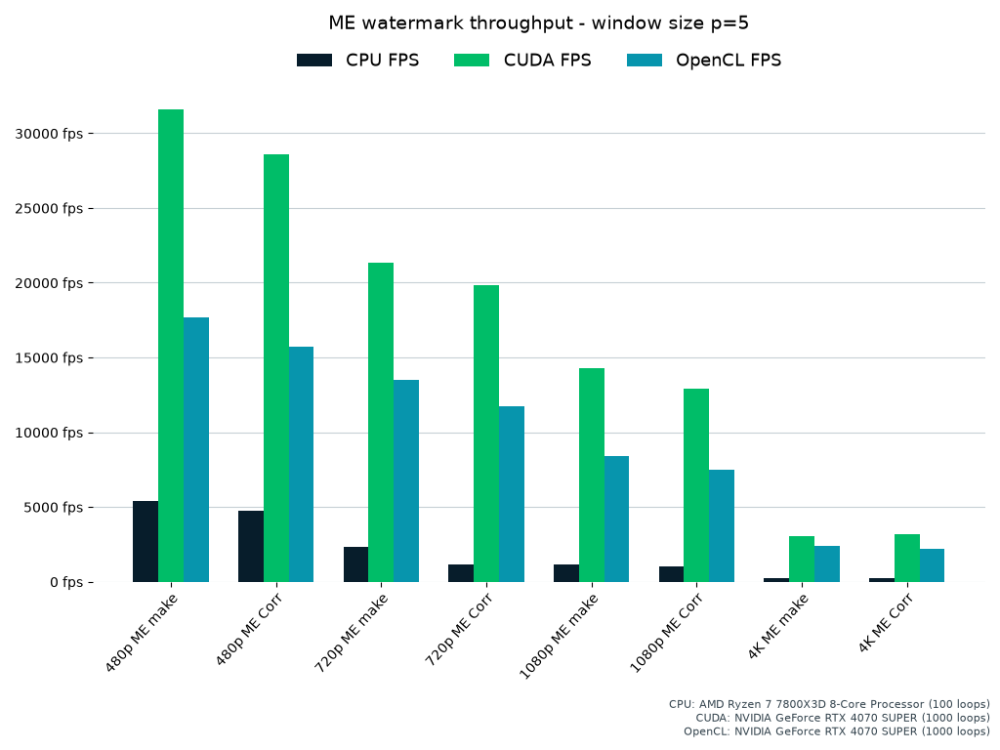
p = 7            |  p = 9
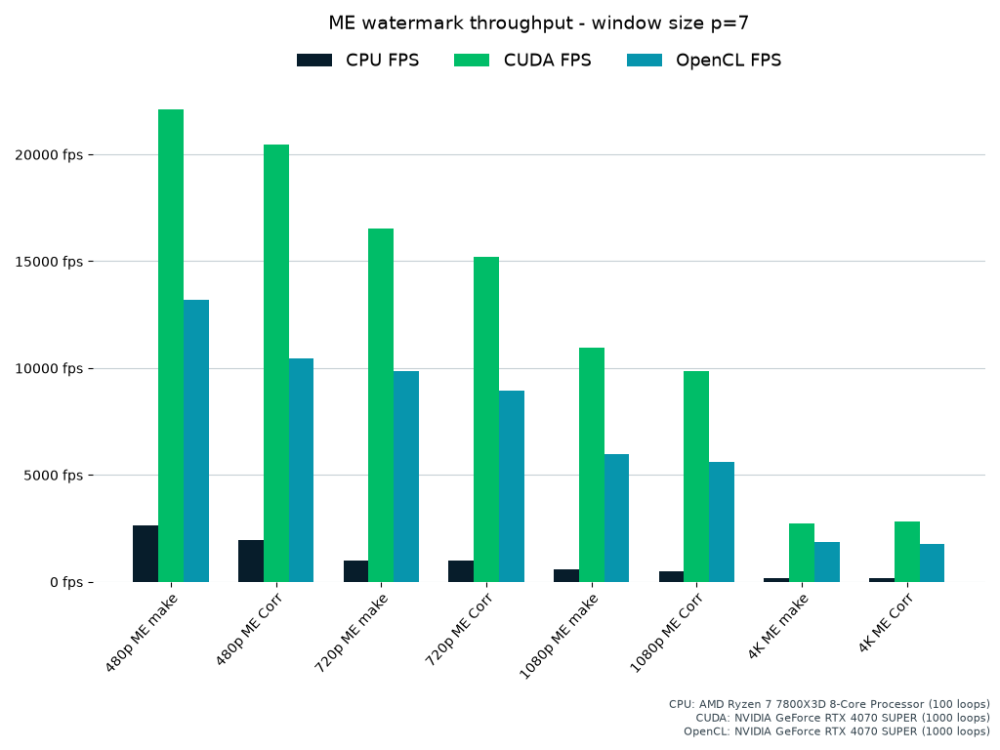 | 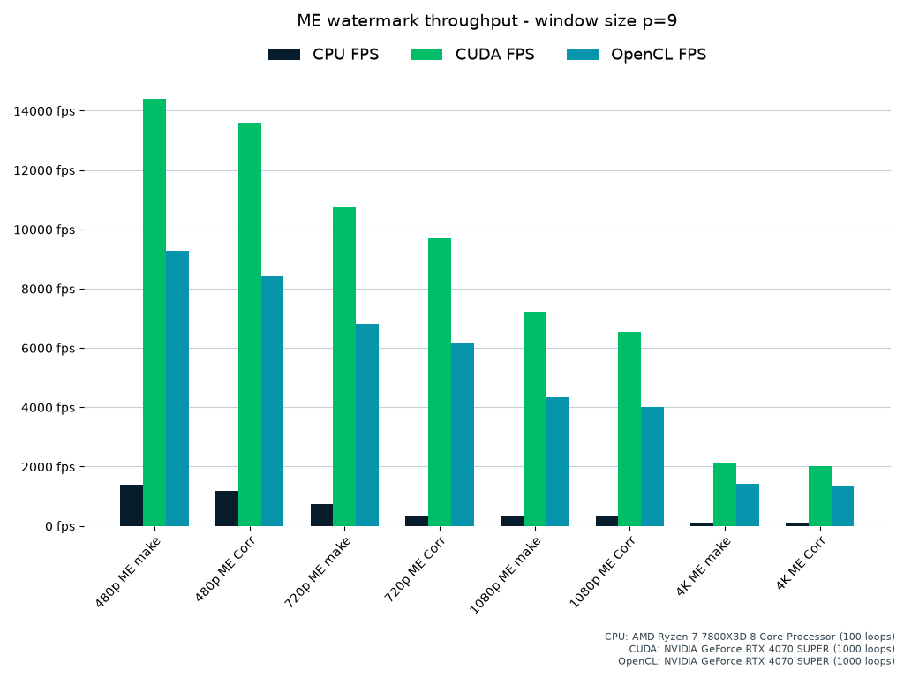

## GUI Benchmark Results

CUDA            |  OpenCL
:-------------------------:|:-------------------------:
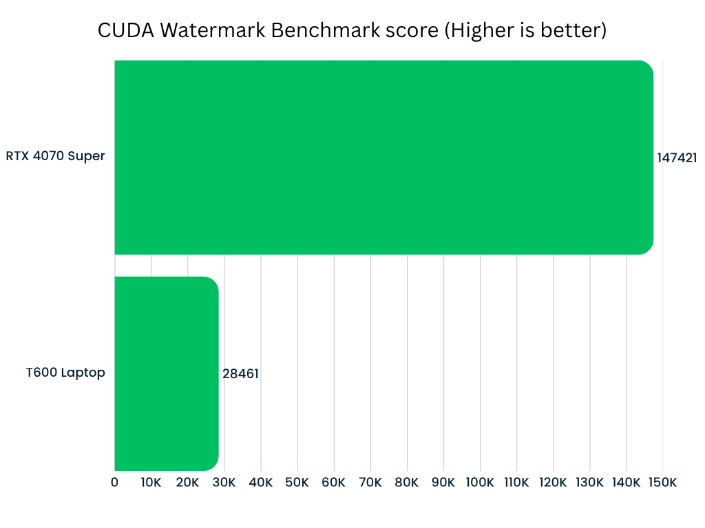 | 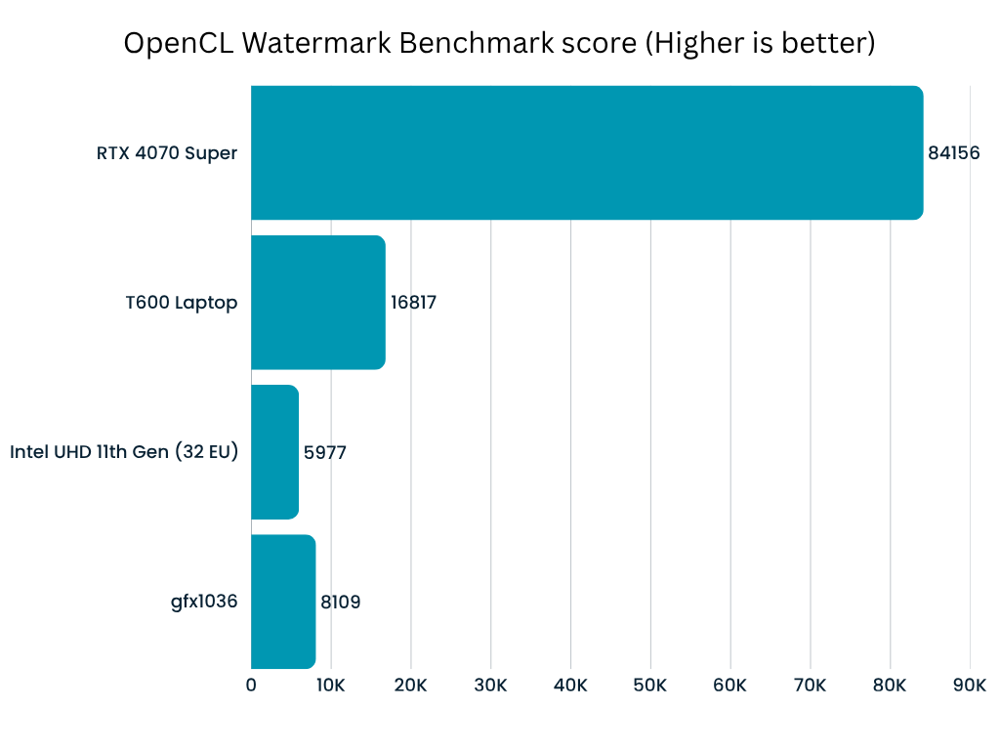
CPU/Eigen            | 
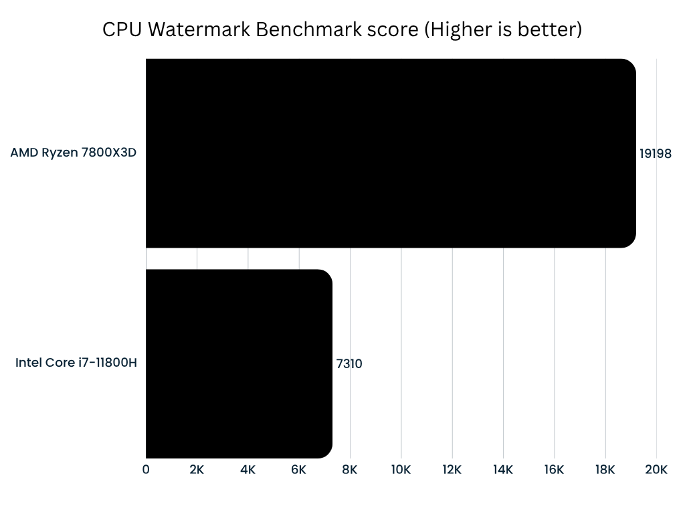 |


## GUI Screens

Preview | Detail
:-------------------------:|:-------------------------:
**Single image comparison**<br>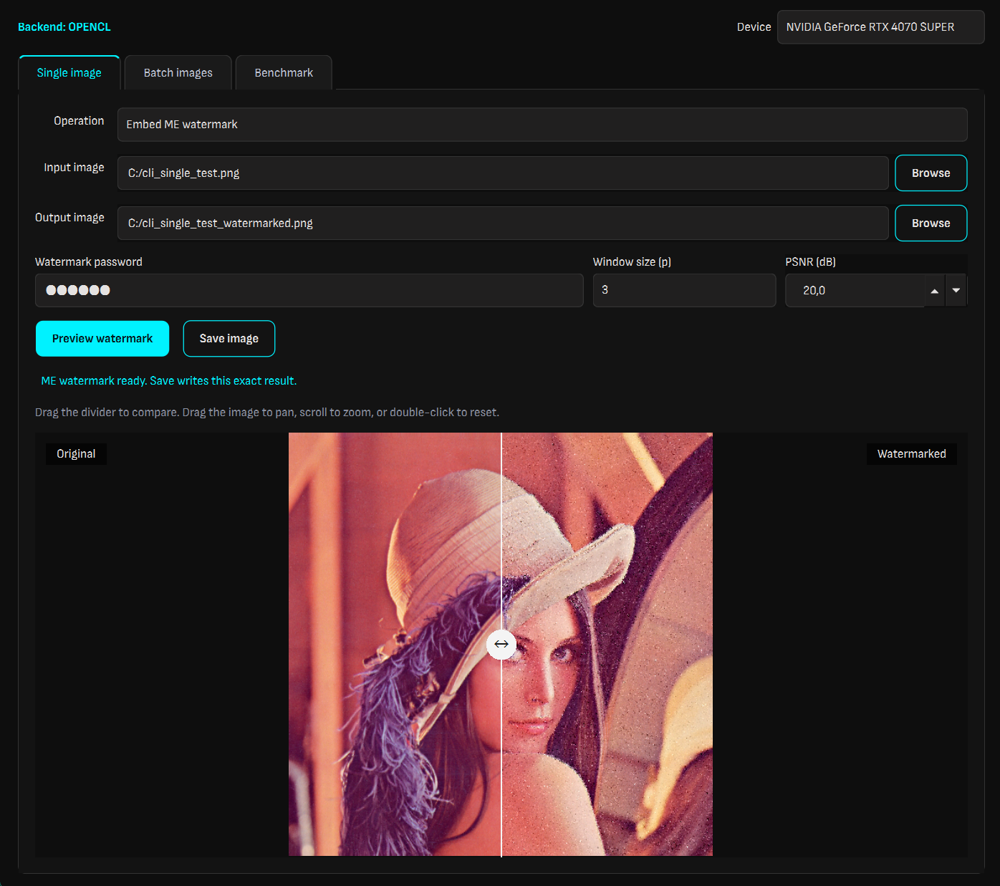 | **Zoomed comparison**<br>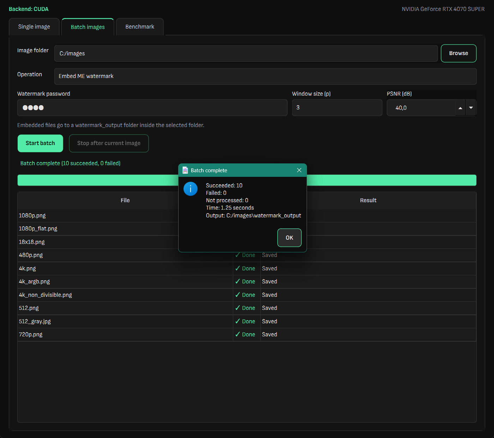
**Batch in progress**<br>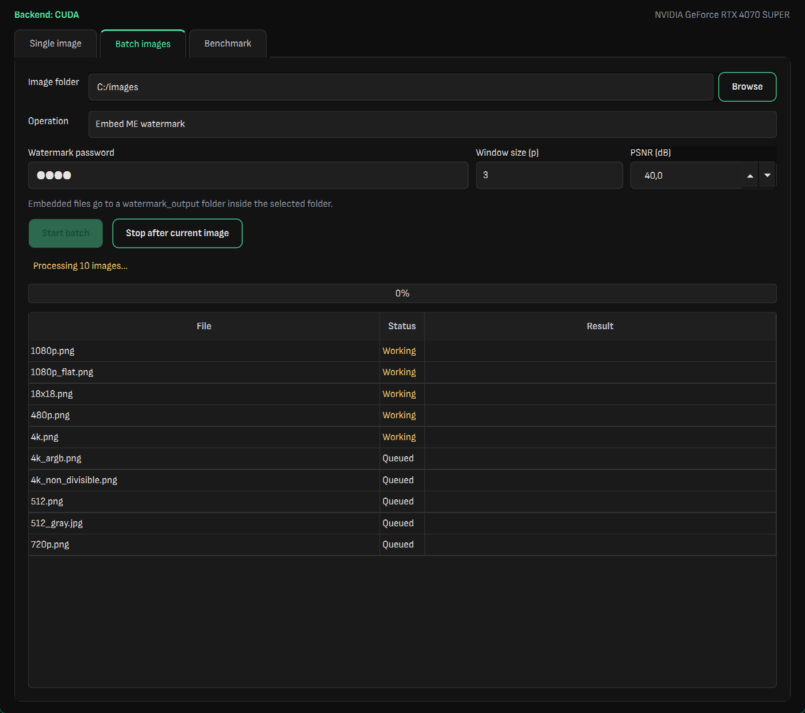 | **Batch complete**<br>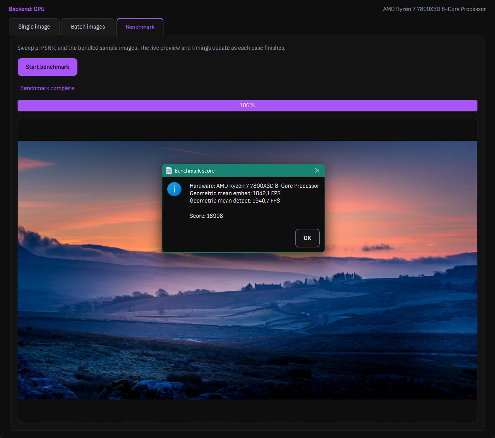
**Benchmark in progress**<br>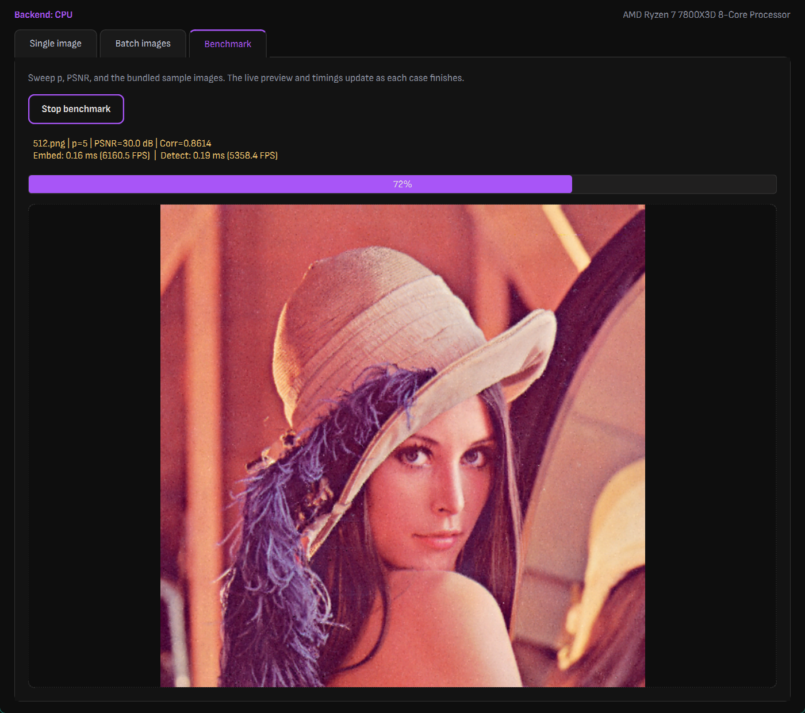 | **Benchmark score**<br>

 
