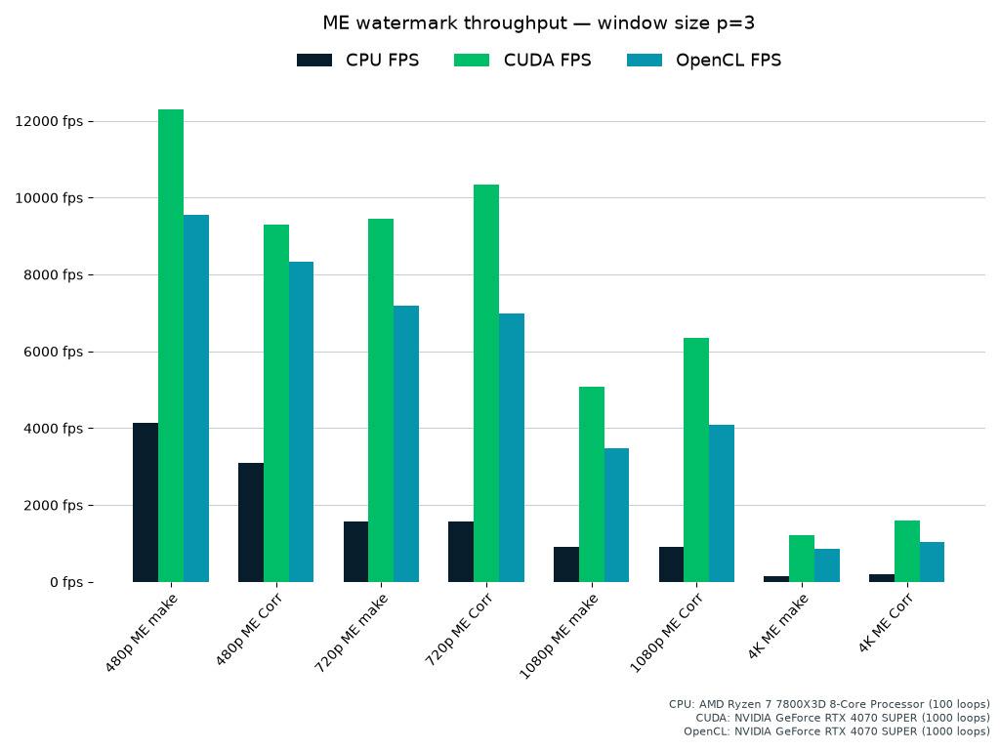
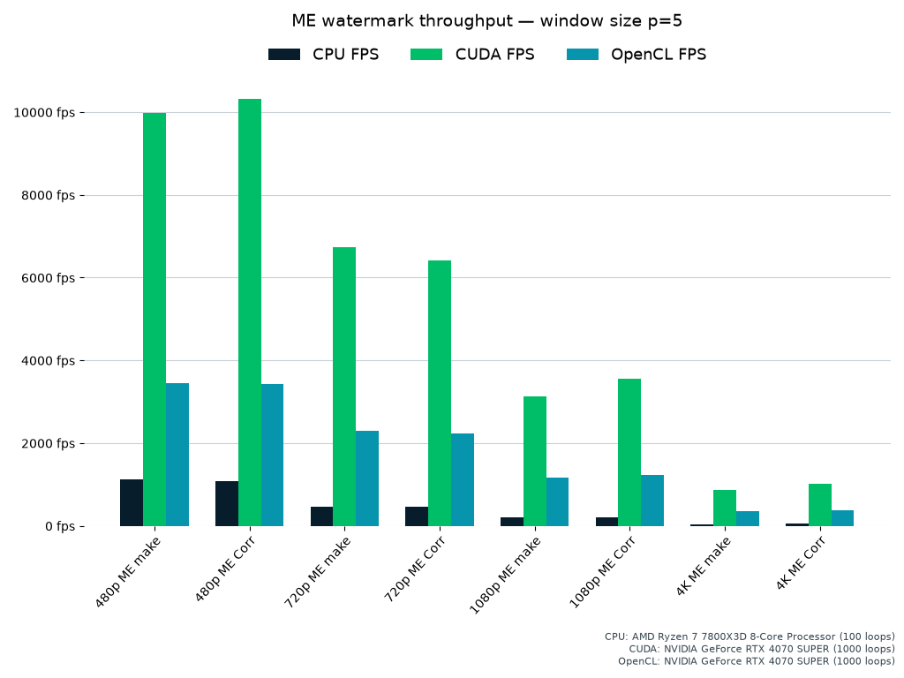
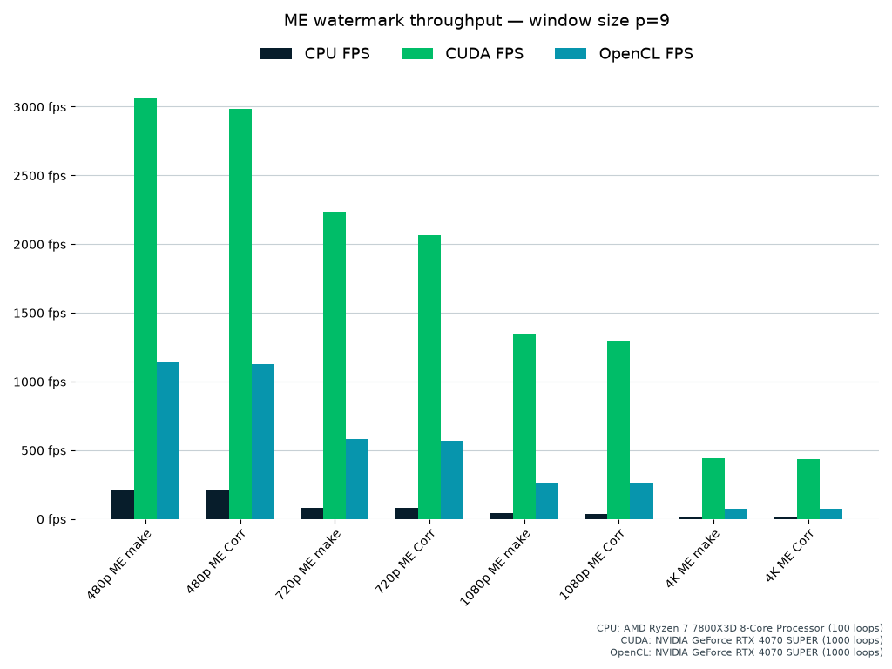

# Efficient Image and Video Watermarking


Code for my Diploma thesis at Information and Communication Systems Engineering (University of the Aegean, School of Engineering) with title "Efficient implementation of watermark and watermark detection algorithms for image and video using the graphics processing unit" [Link](https://hellanicus.lib.aegean.gr/handle/11610/19672).

# Credits and Theoretical Foundation

This implementation is based on the watermarking algorithms proposed by Irene G. Karybali and Kostas Berberidis: [Efficient Spatial Image Watermarking via New Perceptual Masking and Blind Detection Schemes](https://www.icsd.aegean.gr/publication_files/637538981.pdf). The theoretical framework and the mathematical proofs of robustness against attacks are detailed in the original paper.
This repository provides a high performance implementation designed for real-world environments, featuring GPU acceleration, disk images support, and native video container support via FFmpeg.

**NOTE**: This repository features a highly refactored and optimized version of the original Thesis implementation, with improved algorithms, execution times and features.
The deprecated original Thesis code is in the archived repository <a href="https://github.com/kar-dim/Watermarking-GPU/tree/old">old</a> branch. The original Thesis code supported OpenCL and Eigen, while this implementation adds CUDA support.

# Overview

<p align="center">
  
&nbsp; &nbsp; &nbsp; &nbsp;
  
&nbsp; &nbsp; &nbsp; &nbsp;
  
</p>

This project implements and evaluates the performance (execution speed) of image watermarking algorithms on CPU versus GPU. It provides multiple implementations to enable comparisons between compute backends. Watermarks are generated as standard normal distributed matrices (μ=0, σ=1). For cryptographic robustness, a user password is hashed with ```SHA-256``` and this 256-bit value is used as a 256-bit key for the ```ChaCha20 block cipher```. This CSPRNG ensures bit exact, and cross platform determinism. The implementation is highly parallelized with OpenMP. The chosen transform for normal distribution is ```Box-Muller transform```. Two watermark masks are used: The proposed Prediction Error mask, which is the main focus of the Thesis, and the NVF (Noise Visibility Function) mask for comparison purposes. The system supports both embedding and detection of watermarks in disk images and video streams. Video processing is handled via FFmpeg, enabling broad codec and container support, along with advanced features such as GPU-accelerated video decoding and encoding (CUDA only) and 10-bit/HDR (tonemapped) video support.

The repository contains all required source code and dependencies needed to reproduce the benchmarks and experiments.

- Comparative performance analysis between CPU and GPU implementations (check [benchmarks](benchmarks/) folder for more information). To ensure fair and reproducible comparisons across hardware (discrete GPUs vs iGPUs for example), an adaptive time budget benchmarking algorithm is implemented. Unlike fixed loop benchmarks (which can be very slow on weak devices or undersaturate fast ones), the system dynamically adjusts iteration loops based on the coefficient of variation of the execution times, combined with a fixed time budget constraint. This ensures that the FPS values are stable rather than driver latency or OS jitter.

Implementations are optimized for maximum performance:
- CPU implementation: Uses the ```Eigen``` library for linear algebra operations combined with efficient use of ```OpenMP``` multithreading (reductions, parallel loops). The application utilizes all available logical (or physical, specifically on video embedding) CPU cores for maximum performance. The project is configured to use ```clang``` compiler (clang-cl toolset) instead of MSVC, because it optimizes much better the heavily templated Eigen code.
- GPU implementation: Provides both OpenCL and CUDA backends. The ```ArrayFire``` library is also used for backend abstraction and memory management. Specifically for CUDA, we use warp shuffle techniques, CUB, Tensor Cores and Grid-Stride reduction loops to improve performance wherever applicable. Note: ArrayFire is utilized strictly as a high-performance VRAM memory pool and I/O handler. All CUDA/OpenCL core kernels are 100% custom-built for maximum hardware utilization.

<p align="center">
  
  
</p>

# Run the pre-built binaries

Get the latest binaries [here](https://github.com/kar-dim/Watermarking-Accelerated/releases) for Eigen, OpenCL or CUDA platform. The binaries contain:
- The CLI (command line) application and a sample config file (settings.ini).
- The embedded CUDA/OpenCL/Eigen implementations of the watermarking algorithms.
- The benchmark application which benchmarks each backend.
- Some sample image and video files

The CLI application:
   - Embeds or detects the watermark using the NVF and the proposed Prediction-Error mask for images and videos.
   - For image mode only: Supports **batched** operation: It can embed or detect the watermark for all images under a specified folder. It is highly parallelized for both operations to reduce disk I/O latency.
   - Prints FPS/execution time for both operations, and both masks.

The Benchmark application:
  - Embeds the proposed Prediction-Error mask watermark for a predefined set of images and shows the watermarkedf result on the fly in a window.
  - It uses various values of p (window size) and PSNR to test a broad set of combinations.
  - Does not need to parameterized, it is a standalone application used for image benchmarking only. Does not write to disk (only temporary files) nor is used for video.
  - Calculates a **Total Score** using the geometric mean of the two pipelines, scaled by a constant ($C=100$) for readability:

$$\text{Score} = C \cdot \sqrt{\text{FPS}_{\text{embed}} \cdot \text{FPS}_{\text{detect}}}$$

**NOTE**:
1. For video and image batched operations only the proposed mask is used, which is more optimal. The NVF based watermarked image is only saved for single images (explained below) and not in batched mode.
2. CPU implementation is built with AVX2 support: ```-mavx2 -mfma```. To enable AVX-512 replace the previous with: <br/>```-march=native```. The performance gains are negligible, and for much broader compatibility we use AVX2 by default.

The CLI application should be parameterized from the corresponding ```settings.ini``` file. Here is a detailed explanation for each parameter:

| Parameter                         | Description                                                                                                                 |
|-----------------------------------|-----------------------------------------------------------------------------------------------------------------------------               |
| \[image\]/mode                    | ```[single, batch_embed, batch_detect]```: (Image mode only) Set the image mode option. If ```single``` the application will read the image file specified at ```[image]/path]``` and embeds/detects the watermark and prints results. If ```batch_embed``` or ```batch_detect``` then it reads a directory specified at at ```[image]/path]``` and it either embeds the watermark for all the image files it finds, writing them in a new folder called ```watermark_output``` in the specified folder, or it tries to detect the watermark and prints the correlation values.
| \[image\]/path                    | Path to the input image (or directory for batched operations) to embed/detect watermark. This will set the sample application to ```image mode``` |
| watermark_password                | The watermark password. Used to generate a deterministic and secure (as much as possible) watermark. |
| save_to_disk                      | ```[true/false]```: (Image mode only) Set to true to save the watermarked NVF and Prediction-Error files to disk, works only if mode is ```single```.                                                |
| display_fps                       | ```[true/false]```: Set to true to display execution times in FPS. Else, it will display execution time in seconds.                            |
| p                                 | Window size for masking algorithms. All implementations support values of ```p=3,5,7``` and ```9```. |
| psnr                              | PSNR (Peak Signal-to-Noise Ratio). Higher values correspond to less watermark in the image, reducing noise, but making detection harder.   |
| benchmark_loops                   | (Image mode only) Loops the algorithms many times, simulating more work. A value of ```100~1000``` produces consistent execution times. Works only if mode is ```single```.                         |
| opencl_device_id                  | ```[OpenCL only / Number]```: Works only for OpenCL binary. If multiple OpenCL devices are found, then set this to the desired device. Set it to 0 if one device is found. |


**Video-only settings:**

| Parameter                         | Description                                                                                                                 |
|-----------------------------------|-----------------------------------------------------------------------------------------------------------------------------                |
| mode                              | ```[embed/detect]```: Sets the video mode. Both options read the ```[video]/path``` as input video and either embed the watermark encode via ffmpeg) or try to detect the watermark.
| \[video\]/path                    | Path to the video file, if we want to embed or detect the watermark for a video. This will set the sample application to ```video mode``` and will read the video-only settings that are described in this section plus the common settings (```watermark_seed```, ```display_fps```, ```p```, ```psnr``` and ```opencl_device_id```) |
| watermark_interval                | ```[Number]```: Embed or try to detect the watermark every ```watermark_interval``` frames. If set to 1 when embedding, the watermark will be embedded for all frames, which degrades video quality. If the current frame is not divisible by this parameter, then for embedding the frame is passed to the encoder as-is (no watermark), and for detection the frame is decoded and skipped. |
| cuda_hw_decoder                   | ```[CUDA only]```: Offload decoding to the GPU using **NVDEC**. This is **much** more effective on ```HEVC``` or ```AV1``` videos (especially 4K and above) and tasks like watermark detection, as software decoders are generally fast for lower resolutions and less complex algorithms such as ```H264```. Valid options are ```hevc_cuvid``` , ```h264_cuvid``` and ```av1_cuvid```. Other decoders may be available like ```vp9_cuvid```, ```vc1_cuvid``` or ```mjpeg_cuvid```. If HW decoders aren't available, the application will automatically fall back to CPU decoding.|
| cuda_hw_encoder                   | ```[CUDA only: true/false]```: Offload encoding to the GPU using **NVENC**. This makes more sense when combined with **NVDEC** but it is not necessary. If set, then the encoder options of ```encode_codec_options``` settings are ignored, and valid nvenc codec options must be provided in the ```hw_encode_options``` section. |
| encode_output_path                | Set this value to a file path, in order to embed watermark on the video from ```[video]/path``` parameter and save the watermarked file to disk. This will set the sample application to ```video embedding mode```. If you want to detect the watermark from the ```video``` parameter then comment this line, effectively setting the sample application to ```video detect mode```. |
| encode_codec_options              | These are FFmpeg options for encoding only. It configures the coded library and its options. Example: ```-c:v libx265 -preset fast -crf 23```  will pass these encoding options to FFmpeg.|
| hw_encode_options                 | These are FFmpeg options for encoding with NVENC. Only used when `cuda_hw_encoder` is `true` and overwrites the ```encode_codec_options``` option. Example: ```-c:v hevc_nvenc -preset p6 -tune hq -cq 26 -b:v 0``` is the NVENC equivalent to the sample used for CPU encoder. NOTE: Encoding and decoding as separate, we can decode with CPU and encode with NVENC (and vice versa), and of course we can do both!

# FFmpeg Command Used for Video Encoding

The following FFmpeg command is used to encode a new video while preserving the original input's metadata, subtitles, and audio tracks. It decodes the input video, embeds the watermark, and passes the resulting frames into standard input (stdin) for encoding, while copying audio/subtitles from the original input file as is. You can customize **video codec** encoding settings (codec, CRF, presets, etc) via the ```encode_codec_options``` option as described above.
```
ffmpeg -y -f rawvideo
  -pix_fmt <fmt>
  -s <width>x<height>
  -r <frame_rate>
  -i -
  -i <input_video_file>
  <encoder_options>
  -c:s copy -c:a copy
  -map 1:s? -map 0:v -map 1:a?
  -max_interleave_delta 0
  -vf "<rotation>" (OPTIONAL)
  -color_range:v:0 <range>
  <output_file>
```

### Explanation:
- `-f rawvideo -pix_fmt <fmt>`: Specifies raw pixel format, either ```yuv420p``` or ```yuvj420p``` (limited or full range, extracted from the input).
- `-s <width>x<height>`: Specifies frame size (extracted from the input).
- `-r <frame_rate>`: Frame rate of the video (extracted from the input).
- `-i -`: Accepts raw video from stdin.
- `-i <input_video_file>`: **USER SUPPLIED**: Original input file.
- `<encoder_options>`: **USER SUPPLIED**: Encoder options such as codec, preset, and quality options. If CUDA NVENC is requested then it reads the ```hw_encode_options``` parameter from the settings file, else it reads ```encode_codec_options```.
- `-c:s copy -c:a copy`: Copies subtitle and audio streams without re-encoding.
- `-map 1:s? -map 0:v -map 1:a?`: Maps subtitles/audio from the original input, and video from stdin.
- `-max_interleave_delta 0`: Reduces potential interleaving delay issues.
- `-vf "<rotation>"`: Filter to be applied for rotating the output video (optional, may not be set, extracted from the input).
- `-color_range:v:0 <range>`: Sets the output color range metadata to help video players (value of "tv" or "pc" is supplied, extracted from the input).
- `<output_file>`: **USER SUPPLIED**: Output file path for the final video.

**NOTES:** 
- Only Constant Frame Rate (CFR) works as expected for an input video. If the input video is Variable Frame Rate (VFR) there may be issues with audio/subtitles sync on the output file.
- 10-bit video support is experimental: 10-bit non HDR is fully supported. HDR 10-bit is tonemapped (mobius) to SDR by CPU, Hardware accelerated tonemapping is not yet supported by FFMPEG. Encoding is always 8-bit. 

# How to Build

This project is built using **Visual Studio** and consists of a **solution with various projects**.
- Watermarking-Impl: The Core of this project, implements the algorithms for each backend. It also implements a fast, efficient, secure and deterministic watermark generation with OpenMP (CPU-only based). It is built as a **static library**.
- Watermarking-CLI: The sample command line application that interacts with the Core project to embed and detect watermark in images and video.
- Watermarking-BenchUI: The benchmarking project. It interacts with the Core project and benchmarks the performance of image watermarking. It uses Qt for UI.
- Watermarking-Util: Common utility methods without dependencies, that may be used by any project. It is built as a **static library**.
- Watermarking-Tests: Basic tests for the Core project.

### Solution Configurations

The solution provides multiple build configurations, each targeting a specific backend:

| Configuration    | Backend     | Notes                                       |
|------------------|-------------|---------------------------------------------|
| `CUDA_Release`     | CUDA        | Recommended for systems with NVIDIA GPUs. Faster than OpenCL backend, adds support for CUDA HW accelerated video decoding    |
| `CUDA_ReleaseDist` | CUDA        | Release CUDA build which includes SASS for the most common architectures (Fatbin). Specifically: RTX 2000, RTX 3000, RTX 4000 and RTX 5000 SASS is included. Used only when we want to distrubute the executable. In contrast, `CUDA_Release` defines only one architecture for faster builds (RTX 4000).
| `CUDA_Debug`       | CUDA        | Use for debugging CUDA-specific code        |
| `OPENCL_Release`   | OpenCL      | Recommended for systems without NVIDIA GPUs. Provides GPU acceleration across a wide range of hardware (NVIDIA, AMD, Intel, etc.) and delivers better performance than the CPU backend, though typically slower than the CUDA implementation |
| `EIGEN_Release`    | Eigen       | Optimized CPU-based implementation used for its maximum compatibility. Clang compiler is used (clang-cl) for maximum performance [](https://clang.llvm.org/) |
| `EIGEN_Debug`      | Eigen       | Use for debugging CPU implementation [](https://clang.llvm.org/) |


## Build Instructions

1. **Git** must be installed and **Git LFS** is required to download the large library binary dependencies. Install it with: `git lfs install`.
2. Clone this repository: `git clone https://github.com/kar-dim/Watermarking-Accelerated`.
3. Open the `.sln` file in **Visual Studio 2022** (or later).
4. In the **Solution Configurations** dropdown (top toolbar), select your configuration (e.g. `CUDA_Release`) or select `Batch Build` and select what configurations you want to build.
5. Build the solution via **Build > Build Solution**.

We bundle all necessary DLLs with the prebuilt binaries so the application runs out-of-the-box without requiring a local ArrayFire or CImg development environment.

| Backend | Dependencies |
|---------|--------------|
| **All** |	`FFmpeg (all libav*.dll binaries)` |
| **CUDA** | `FreeImage.dll`, `afcuda.dll`, `cublas64_12.dll`, `cublasLt64_12.dll`, `cufft64_11.dll`, `cusolver64_11.dll`, `cusparse64_12.dll`, `nvrtc64_120_0.dll`, `nvJitLink_120_0.dll` |
| **OpenCL** | `FreeImage.dll`, `afopencl.dll`, `mkl_rt.2.dll` |
| **Eigen** | `zlib1.dll`, `libpng16.dll`, `jpeg62.dll`, `tiff.dll`, `libomp.dll`, `libwebp.lib` (static lib) |

**NOTES:**
- OpenCL implementation: The [OpenCL Headers](https://github.com/KhronosGroup/OpenCL-Headers), [OpenCL C++ Bindings](https://github.com/KhronosGroup/OpenCL-CLHPP) and [OpenCL Library file](https://github.com/KhronosGroup/OpenCL-SDK) are already included and configured for this project.
- CUDA implementation: NVIDIA CUDA Toolkit is required for building. Minimum supported GPUs with Compute Capability 7.0 (sm_75) or newer, CUDA Toolkit 10.0 or newer.
- CPU Implementation: Image libraries (libjpeg, libpng, libtiff etc) are included and utilized internally by CImg for loading and saving of images.
- ArrayFire should be installed globally, with default installation options. Environment Variable "AF_PATH" will be defined automatically.
- FFmpeg must exist on system PATH (Pre-build binaries already include FFmpeg binaries and DLLs).

# Libraries/Tools Used

- [Eigen](https://eigen.tuxfamily.org/index.php?title=Main_Page): A C++ template library for linear algebra.
- [ArrayFire](https://arrayfire.org): A C++ library for fast GPU computing.
- [FFmpeg](https://www.ffmpeg.org/): A complete, cross-platform solution to record, convert and stream audio and video.
- [CImg](https://cimg.eu/): A C++ library for image processing.
- [inih](https://github.com/jtilly/inih): A lightweight C++ library for parsing .ini configuration files.
- [cub](https://github.com/NVIDIA/cccl): A lower-level CUDA library designed for speed-of-light parallel algorithms. Used for device-wide, block-wide, and warp-wide reductions.
- [Intel VTune Profiler](https://www.intel.com/content/www/us/en/develop/tools/vtune-profiler.html) and [AMD uProf](https://developer.amd.com/amd-uprof/): Used to profile CPU performance.
- [NVIDIA Nsight Systems](https://developer.nvidia.com/nsight-systems) and [NVIDIA Compute](https://developer.nvidia.com/nsight-compute): Used to profile overall system-wide CUDA performance, and to individually profile specific CUDA kernels with detailed performance metrics.

# Comparisons

Below we include some comparisons of the original image (left) versus the final watermarked images based on the NVF mask (middle) and the proposed Prediction error mask (right). Images are zoomed for comparison purposes. <br><br>
<p>Resolution: 512x152, p=5, PSNR=40dB</p>
 <br><br><br>
<p>Resolution: 1280x720, p=5, PSNR=45dB</p>
 <br><br><br>
<p>Resolution: 3840x2160, p=5, PSNR=40dB</p>


# Benchmarks

This section includes a performance comparison between the three backends: CPU (Eigen), CUDA, and OpenCL. The benchmarks measure the throughput (in Frames Per Second) of the watermarking algorithm across various resolutions (480p to 4K) and window sizes (p=3,5,7,9). The results are also available in the `time_comparisons.zip` file on the [Releases](https://github.com/kar-dim/Watermarking-Accelerated/releases) section. They are generated by running the CLI in ```single image``` mode with ```1000``` loops to ensure stability, for each image used in the ```samples``` directory (in Releases).

## Test Environment

All benchmarks were conducted on the following hardware configuration:

- CPU: AMD Ryzen 7 7800X3D (8-Core)
- GPU: NVIDIA RTX 4070 SUPER (12 GB VRAM)
- RAM: 32 GB DDR5 @ 6000 MHz (2x16GB)

## Methodology

Tests were executed with a loop count of 1000 iterations to ensure statistical stability. The graphs below illustrate the performance scaling for both the embedding (ME make) and correlation (ME Corr) phases.

## Observations

- CUDA: Consistently delivers the highest throughput and it is the ideal choice for realtime applications.
- OpenCL: Serves as a middle ground, offering some healthy acceleration over the CPU, while maintaining portability across non-NVIDIA hardware (AMD, Intel, etc). Its main purpose is to offload work from CPU to GPU in order to free the CPU for other tasks (like video encoding or batched processing).
- CPU: Functions as the fallback implementation. While slower, it is optimized for CPU architecture, and also ensures compatibility on systems without dedicated GPUs.

- Impact of Window Size (p): As the window size increases, the computational complexity grows quadratically.
     - p=3 (Small Window): Extremely high throughput.
     - p=9 (Large Window): Throughput naturally decreases due to the heavier matrix construction and solving steps (80×80 linear systems), but the CUDA implementation still maintains real-time performance thanks to the Tensor Cores and exclusive features (warp shuffles, fast atomics).

- Resolution Scaling: Performance scales inversely with pixel count. However, even at 4K resolution, the GPU implementations remain viable for interactive framerates, whereas the CPU implementation becomes a bottleneck.

p = 3            |  p = 5
:-------------------------:|:-------------------------:
 | 
p = 7            |  p = 9
 | 

# Benchmark UI

 Benchmark screen | Result screen
:-------------------------:|:-------------------------:
 | 
 | 
 
