# Efficient Image and Video Watermarking


Code for my Diploma thesis at Information and Communication Systems Engineering (University of the Aegean, School of Engineering) with title "Efficient implementation of watermark and watermark detection algorithms for image and video using the graphics processing unit" [Link](https://hellanicus.lib.aegean.gr/handle/11610/19672).

**NOTE**: This repository features a highly refactored and optimized version of the original Thesis implementation, with improved algorithms, execution times and many more features such as CUDA support and FFmpeg integration. The deprecated original Thesis code is in the archived repository <a href="https://github.com/kar-dim/Watermarking-GPU/tree/old">old</a> branch.

# Credits and Theoretical Foundation

This implementation is based on the watermarking algorithms proposed by Irene G. Karybali and Kostas Berberidis: [Efficient Spatial Image Watermarking via New Perceptual Masking and Blind Detection Schemes](https://www.icsd.aegean.gr/publication_files/637538981.pdf). The theoretical framework and the mathematical proofs of robustness against attacks are detailed in the original paper.
This repository provides a high performance implementation designed for real-world environments, featuring GPU acceleration, disk images support, and native video container support via FFmpeg.

# Overview

<p align="center">
  
</p>

This project implements and evaluates the performance (execution speed) of image watermarking algorithms on CPU versus GPU. It provides multiple implementations to enable comparisons between compute backends. Watermarks are generated as standard normal distributed matrices (μ=0, σ=1). For cryptographic robustness, a user password is hashed with ```SHA-256``` and this 256-bit value is used as a 256-bit key for the ```ChaCha20 block cipher```. The CSPRNG produces a deterministic stream of random bits. The chosen transform for normal distribution is ```Box-Muller transform```, computed with fixed polynomial approximations and explicit FMA operations and every backend produces the same watermark bit for bit. The GPU backends generate the watermark on the GPU, while the CPU backend uses AVX2/AVX-512 with OpenMP. The watermark strength follows the proposed Prediction Error (ME) mask, which is the main focus of the Thesis. The system supports both embedding and detection of watermarks in disk images and video streams. Video processing is handled via FFmpeg, enabling broad codec and container support, along with advanced features such as GPU-accelerated video decoding and encoding (CUDA only) and 10-bit/HDR (tonemapped) video support.

The repository contains all required source code and dependencies needed to reproduce the benchmarks and experiments.

- Comparative performance analysis between CPU and GPU implementations (see the [benchmark figures](readme_pictures/)). The CLI benchmark uses a configurable fixed loop count. The Qt Benchmark tab adapts its measurement time and loop count using the coefficient of variation, which helps stabilize FPS readings across devices.

Implementations are optimized for maximum performance:
- CPU implementation: Uses the ```Eigen``` library for linear algebra operations combined with efficient use of ```OpenMP``` multithreading (reductions, parallel loops). The application utilizes all available logical (or physical, specifically on video embedding) CPU cores for maximum performance. The project is configured to use ```clang``` compiler (clang-cl toolset) instead of MSVC, because it optimizes much better the heavily templated Eigen code.
- GPU implementation: Provides both OpenCL and CUDA backends. All CUDA/OpenCL kernels are 100% custom-built for maximum hardware utilization.
  - CUDA: Warp shuffle techniques, CUB block reductions, shared memory tiling and CUDA Graphs (one launch per frame instead of 6-8) are used in order to improve performance wherever applicable.
  - OpenCL: A custom kernel caching mechanism is implemented (because OpenCL kernels are compiled at runtime), and need special care to reduce extra re-compilations. 
  - All: In order to optimize VRAM usage, custom memory pools are implemented for both backends. The watermark and the strengthened watermark are stored as 16-bit floats (half) to save memory bandwidth, all math is done in 32-bit floats.

### How the prediction error (ME) mask is computed fast

The ME mask predicts every pixel from its p x p - 1 neighbors. The prediction coefficients come from solving a small linear system ```Rx * a = rx```, where every entry of ```Rx``` and ```rx``` is a sum over the whole image of one neighbor pixel multiplied by another neighbor pixel. The direct way builds a big matrix with one row per pixel and multiplies it by its transpose: for p=9 that is 3,320 different sums over all the pixels.

The trick: the sum for neighbors ```a``` and ```b``` only depends on how far apart they are (the shift ```b - a```), not on where they are in the window. The image multiplied by a copy of itself shifted by the same amount gives the same sum, only the few border rows and columns covered by each pair are different. So we compute **one sum per distinct shift** (13, 41, 85 and 145 sums for p=3, 5, 7, 9) over the inner image area, add the small border corrections, and build the whole system from these sums. For p=9 this is about 23x less math, and no matrix multiplication is needed. The system is then solved with a Cholesky decomposition (the sums are exact fixed point integers on the GPU, so the result is the same on every run), and the prediction error of each pixel is computed from the coefficients in shared memory tiles.


# Run the pre-built binaries

Get the latest binaries [here](https://github.com/kar-dim/Watermarking-Accelerated/releases) for Eigen, OpenCL or CUDA platform. The binaries contain:
- The CLI (command line) application.
- The embedded CUDA/OpenCL/Eigen implementations of the watermarking algorithms.
- The Qt application for single-image watermarking, image batches, and backend benchmarking.
- Some sample image and video files

The CLI application:
   - Embeds the proposed Prediction-Error mask once for a single image, writes the requested output file, and reports total image time including load, watermark setup, embed, and save.
   - For image mode only: Supports **batched** operation: It can embed or detect the watermark for all images under a specified folder. It is highly parallelized for both operations to reduce disk I/O latency.
   - Provides a separate `--bench` mode for repeated ME embedding and detection measurements and CSV output. Add `--bench-save` to save the benchmark images.

The Qt application:
  - **Single image:** choose Embed or Detect, an image, password, and p. Embed also lets you set PSNR, compare the original and watermarked result with a draggable divider, pan and zoom the preview, then save the result. The comparison respects EXIF orientation. Detect shows the ME correlation in a compact result card without writing a file. Drop supported images into the window to select the first one. Changing embed settings keeps the previous comparison visible until you preview again.
  - **Batch images:** choose or drop a folder to embed or detect the ME watermark. Supported image files in that folder populate a queue, which shows the state of each image, and a completion dialog summarizes the run. PSNR is shown only for embedding. Embedded images go to a `watermark_output` subfolder.
  - **Benchmark:** runs the predefined image, p, and PSNR sweep, shows the live watermarked image and timings, and can be stopped without a score dialog. A completed run presents the final score in a dialog. The score uses the geometric mean of the two pipelines, scaled by a constant ($C=10$) for readability:

$$\text{Score} = C \cdot \sqrt{\text{FPS}_{\text{embed}} \cdot \text{FPS}_{\text{detect}}}$$

**NOTE**:
1. The CLI uses the proposed mask for single images, batches, video, and its `--bench` mode.
2. All implementations are built with ```AVX2``` support, set once for every project in ```Directory.Build.props```:
     - clang (CPU builds): ```-mavx2 -mfma -mf16c```
     - MSVC (GPU builds): ```/arch:AVX2```

To build with ```AVX-512```, pass ```-p:WatermarkingSimd=AVX512``` to MSBuild (for example ```msbuild Watermarking-Thesis.sln -p:Configuration=EIGEN_Release -p:Platform=x64 -p:WatermarkingSimd=AVX512```). The output goes to separate folders (```x64\EIGEN_Release_AVX512\```), next to the AVX2 build. The AVX-512 build only runs on CPUs with AVX-512 and the gains are small, AVX2 stays the default.

The CLI accepts command-line options only. Values can use `--key value` or `--key=value`, for example `--p 5`, `--psnr=42`, or `--gpu_device_id 1`. The duplicated `mode` and `path` names must include their group: `--image.mode`, `--image.path`, `--video.mode`, and `--video.path`. Other options also accept a group prefix, such as `--global.p` or `--compute.gpu_device_id`. Run `Watermarking-CLI.exe --help`, or run without arguments, for the complete list and defaults.

Image and video operations require an explicit `--watermark_password`. The defaults are `p=3`, PSNR 40 dB, and image mode `single`, supply the input and destination paths for an image embed:

```powershell
Watermarking-CLI.exe --image.path samples/images/720p.png --output_path 720p_watermarked.png --watermark_password "your-password"
```

For the repeated benchmark, use `Watermarking-CLI.exe --bench --benchmark_loops 100`. Benchmarks use a fixed password unless `--watermark_password` is supplied. CLI commands exit without an interactive pause, `--no-pause` remains accepted for existing scripts.

| Option | Description |
|---|---|
| `--image.mode` | `single` (default), `batch_embed`, or `batch_detect`. Single mode embeds ME once and saves to `--output_path`. Batch modes process images in `--image.path`, embedding writes to its `watermark_output` subdirectory. |
| `--image.path` | Input image, or input directory for batch mode. |
| `--output_path` | Required destination filename for single mode. The input image cannot be overwritten. |
| `--watermark_password` | Password used to generate the deterministic watermark. Required for image/video operations. |
| `--display_fps` | Show video execution times as FPS (`true`, default) or seconds (`false`). |
| `--p` | Prediction window size: 3 (default), 5, 7, or 9. Images and frames must be at least `p x p` pixels. |
| `--psnr` | Positive, finite embed PSNR in dB (default: 40). Higher values reduce watermark strength and can make detection harder. |
| `--benchmark_loops` | Positive measured iteration count for `--bench` only. Defaults to 100 on Eigen and 1000 on GPU backends. |
| `--gpu_device_id` | Zero-based CUDA/OpenCL GPU index (default: 0). An invalid index falls back to 0. |

**Video-only options:**

Providing `--video.path` selects video processing. For example, to detect a watermark:

```powershell
Watermarking-CLI.exe --video.path samples/videos/sample_1080p.mkv --video.mode detect --watermark_password "your-password"
```

| Option | Description |
|---|---|
| `--video.mode` | `embed` (default) or `detect`. Both modes read `--video.path`: embedding re-encodes the watermarked video. |
| `--video.path` | Input video filename. Uses the common password, p, PSNR, timing, and device options above. |
| `--watermark_interval` | Embed or detect every Nth frame (N >= 1, default: 1). Other frames pass unchanged to the encoder when embedding, or are skipped when detecting. |
| `--cuda_hw_decoder` | Use NVDEC with CPU fallback (`true`, default: CUDA only). The codec is selected from the input stream automatically. |
| `--cuda_hw_encoder` | Use NVENC (`false` by default). Available on all backends with a compatible NVIDIA GPU. Uses `--hw_encode_options` instead of `--encode_codec_options`, Eigen/OpenCL incur host/device transfers. |
| `--encode_output_path` | Required destination filename for video embedding. Use `--video.mode detect` to detect without writing a video. |
| `--encode_codec_options` | Software encoder and quality options. Default: `-c:v libx265 -preset fast -crf 23`. Quote the whole value when passing it on the command line. |
| `--hw_encode_options` | NVENC encoder and quality options, used only when `--cuda_hw_encoder true`. Default: `-c:v hevc_nvenc -preset p6 -tune hq -cq 26 -b:v 0`. Quote the whole value. Encoding and decoding can independently use hardware acceleration. |

# Video Encoding Pipeline

The application uses the **FFmpeg libraries (libav\*)** directly, no `ffmpeg.exe` is required or invoked. It decodes the input, watermarks selected luma frames, re-encodes the video, and remuxes compatible audio and subtitle streams. Incompatible text subtitles may be transcoded and unsupported subtitles are dropped. Matroska attachments, chapters, and metadata are preserved where supported. Decoded frame PTS and durations are forwarded to the encoder and invalid output video DTS is repaired before muxing.

You can customize the video codec and its quality settings via the ```encode_codec_options``` / ```hw_encode_options``` parameters described above.

### Equivalent FFmpeg CLI command (for reference)

The pipeline is functionally equivalent to the following FFmpeg CLI invocation. This is provided purely for documentation purposes, the application does **not** call `ffmpeg.exe`. NOTE: ffmpeg normally requires `-framerate` option when `rawvideo` is used, but because we use libav directly, we control PTS/DTS handling, and thus both CFR **AND** VFR are supported.

```
ffmpeg -y -f rawvideo
  -pix_fmt yuv420p
  -s <width>x<height>
  -i -
  -i <input_video_file>
  <encoder_options>
  -c:s copy -c:a copy
  -map 1:s? -map 0:v -map 1:a?
  <output_file>
```

- `-f rawvideo -pix_fmt yuv420p`: Raw 8-bit planar YUV input from stdin (watermarked frames).
- `-i -`: Watermarked video frames piped from the application.
- `-i <input_video_file>`: **USER SUPPLIED** original source file (audio/subtitles remuxed from here).
- `<encoder_options>`: **USER SUPPLIED** codec, preset, and quality flags from ```encode_codec_options``` (or ```hw_encode_options``` when NVENC is enabled).
- `-c:s copy -c:a copy`: Audio and subtitle streams copied without re-encoding.
- `-map 1:s? -map 0:v -map 1:a?`: Video from the watermarked stream, audio/subtitles from the original input.
- Muxing uses FFmpeg's default interleave limit (10 seconds, `max_interleave_delta` ffmpeg option), keeping buffering finite for empty or sparse auxiliary streams. Encoder options cannot override this limit.
- `<output_file>`: **USER SUPPLIED** — destination path set via ```encode_output_path```.

**NOTE:** 10-bit video is supported: 10-bit SDR is converted to 8-bit before watermarking (`format=yuv420p` on the CPU decoder, `scale_cuda=format=nv12` on NVDEC), so each sample loses precision (10 to 8 bits). HDR 10-bit is tonemapped with the Mobius algorithm to SDR. If CPU decoder is used, then we use the FFmpeg's `tonemap=mobius` filter. For Hardware-accelerated decoder (NVDEC) a custom Mobius kernel pipeline is implemented, because currently it is impossible to do the tonemapping by FFmpeg provided filters. Encoding output is always 8-bit SDR.

# How to Build

This project is built using **Visual Studio** and consists of a **solution with various projects**.
- Watermarking-Core: The Core of this project, implements the algorithms for each backend. It also implements a fast, efficient, secure and deterministic watermark generation: CUDA/OpenCL kernels on the GPU, AVX2/AVX-512 with OpenMP on the CPU, with identical results. It is built as a **static library**.
- Watermarking-CLI: The sample command line application that interacts with the Core project to embed and detect watermark in images and video.
- Watermarking-UI: The Qt image workflow and benchmark application. It uses the Core project for single-image embedding, image batches, and performance measurements.
- Watermarking-Core-tests: GoogleTest suite for the Core project. Runs from the build output folder (the samples are copied there at build time).

### Solution Configurations

The solution provides multiple build configurations, each targeting a specific backend:

| Configuration    | Backend     | Notes                                       |
|------------------|-------------|---------------------------------------------|
| `CUDA_Release`     | CUDA        | Recommended for systems with NVIDIA GPUs. Faster than OpenCL backend, adds support for CUDA HW accelerated video decoding. Builds a fat binary with SASS and PTX for Turing (sm_75), Ampere (sm_80, sm_86), Ada (sm_89), Hopper (sm_90) and Blackwell (sm_120); other GPUs JIT from the closest PTX |
| `CUDA_Debug`       | CUDA        | Use for debugging CUDA-specific code        |
| `OPENCL_Release`   | OpenCL      | Recommended for systems without NVIDIA GPUs. Provides GPU acceleration across a wide range of hardware (NVIDIA, AMD, Intel, etc.) and delivers better performance than the CPU backend, though typically slower than the CUDA implementation |
| `EIGEN_Release`    | Eigen       | Optimized CPU-based implementation used for its maximum compatibility. Clang compiler is used (clang-cl) for maximum performance [](https://clang.llvm.org/) |
| `EIGEN_Debug`      | Eigen       | Use for debugging CPU implementation [](https://clang.llvm.org/) |


## Build Instructions

1. **Git** must be installed and **Git LFS** is required to download the large library binary dependencies. Install it with: `git lfs install`.
2. Clone this repository: `git clone https://github.com/kar-dim/Watermarking-Accelerated`.
3. Open the `.sln` file in **Visual Studio 2022** (or later).
4. In the **Solution Configurations** dropdown (top toolbar), select your configuration (e.g. `CUDA_Release`) or select `Batch Build` and select what configurations you want to build.
5. Build the solution via **Build > Build Solution**.

We bundle all necessary DLLs with the prebuilt binaries so the application runs out-of-the-box as a fully self-contained bundle with no need to install the Visual C++ Redistributable.

| Backend | Dependencies |
|---------|--------------|
| **All** |	`Microsoft Visual C++ CRT (msvcp140*.dll, vcruntime140*.dll, concrt140*.dll, etc.)`, `FFmpeg libav dll`, `zlib1.dll`, `libpng16.dll`, `jpeg62.dll`, `tiff.dll`, `libwebp.lib` (static lib) |
| **CUDA** | `nvjpeg64_13.dll` (from CUDA Toolkit) |
| **OpenCL** | `OpenCL.dll` (system drivers)|
| **Eigen** | `libomp.dll` (clang's OpenMP) |

**NOTES:**
- OpenCL implementation: The [OpenCL Headers](https://github.com/KhronosGroup/OpenCL-Headers), [OpenCL C++ Bindings](https://github.com/KhronosGroup/OpenCL-CLHPP) and [OpenCL Library file](https://github.com/KhronosGroup/OpenCL-SDK) are already included and configured for this project.
- CUDA implementation: NVIDIA CUDA Toolkit is required for building. Minimum supported GPUs with Compute Capability 7.5 (sm_75) or newer, CUDA Toolkit 12.4 or newer preferred.
- Image libraries ([libjpeg-turbo](https://github.com/libjpeg-turbo/libjpeg-turbo), [libpng](https://github.com/pnggroup/libpng), [zlib-ng compat](https://github.com/zlib-ng/zlib-ng), [libtiff](https://gitlab.com/libtiff/libtiff) and [libwebp](https://github.com/webmproject/libwebp)) are included and utilized internally by CImg for loading and saving of images for all backends.
- FFmpeg and Microsoft Visual C++ runtime DLLs are copied automatically after build. Pre-built binaries already include them, making the application fully self-contained without requiring `vc_redist.x64.exe`.
- File and folder names with non-ASCII characters (for example Greek) work in the CLI and the Qt application: every executable runs with the UTF-8 process code page (```utf8.manifest```, Windows 10 version 1903 or newer).

# Libraries/Tools Used

- [Eigen](https://eigen.tuxfamily.org/index.php?title=Main_Page): A C++ template library for linear algebra.
- [FFmpeg](https://www.ffmpeg.org/): A complete, cross-platform solution to record, convert and stream audio and video.
- [CImg](https://cimg.eu/): A C++ library for image processing.
- [cub](https://github.com/NVIDIA/cccl): A lower-level CUDA library designed for speed-of-light parallel algorithms. Used for device-wide, block-wide, and warp-wide reductions.
- [nvJPEG](https://developer.nvidia.com/nvjpeg): NVIDIA's high-performance GPU-accelerated library for decoding, encoding and transcoding JPEG format images (CUDA only).
- [Intel VTune Profiler](https://www.intel.com/content/www/us/en/develop/tools/vtune-profiler.html) and [AMD uProf](https://developer.amd.com/amd-uprof/): Used to profile CPU performance.
- [NVIDIA Nsight Systems](https://developer.nvidia.com/nsight-systems) and [NVIDIA Compute](https://developer.nvidia.com/nsight-compute): Used to profile overall system-wide CUDA performance, and to individually profile specific CUDA kernels with detailed performance metrics.


# Benchmarks

This section includes performance comparisons between the three backends: CPU (Eigen), CUDA, and OpenCL. The benchmarks measure the throughput (in Frames Per Second) of the watermarking algorithm across various resolutions (480p to 4K) and window sizes (p=3,5,7,9). Two kind of benchmarks are done:
- The first set is generated by running the automated CLI benchmark with ```1000``` loops for GPU backends and ```100``` loops for the CPU backend, for each benchmark image in the ```samples``` directory. It is run on a machine with the below Hardware specs:
    - CPU: AMD Ryzen 7 7800X3D (8-Core)
    - GPU: NVIDIA RTX 4070 SUPER (12 GB VRAM)
    - RAM: 32 GB DDR5 @ 6000 MHz (2x16GB)
- The second set uses the Benchmark tab of the Qt application. While currently tested on a limited selection of hardware, we aim to expand this list significantly. Community submissions are of course welcome!

## CLI Benchmark

The CLI benchmark sweep can be reproduced automatically from the repository root:

```powershell
python benchmark.py --run
```

This runs the CUDA and OpenCL Release CLIs with 1000 loops per measurement and the Eigen/CPU Release CLI with 100 loops. Pass `--loops N` to `benchmark.py --run` to set the same positive loop count for all three backends. Each CLI's ```--bench``` mode benchmarks ME embedding and detection for p=3,5,7,9 using the 480p, 720p, 1080p, and 4K sample images. Raw results are written to ```readme_pictures/cuda.csv```, ```readme_pictures/opencl.csv```, and ```readme_pictures/eigen.csv```, after which figures 1–4 are regenerated. To redraw the figures without rerunning the benchmarks, use ```python benchmark.py --figures```. A GPU can be selected with ```--cuda-device-id N``` and ```--opencl-device-id N``` when using ```--run``` (separate options because CUDA and OpenCL number the devices differently, OpenCL also lists integrated GPUs and enumerates GPU devices only).

p = 3            |  p = 5
:-------------------------:|:-------------------------:
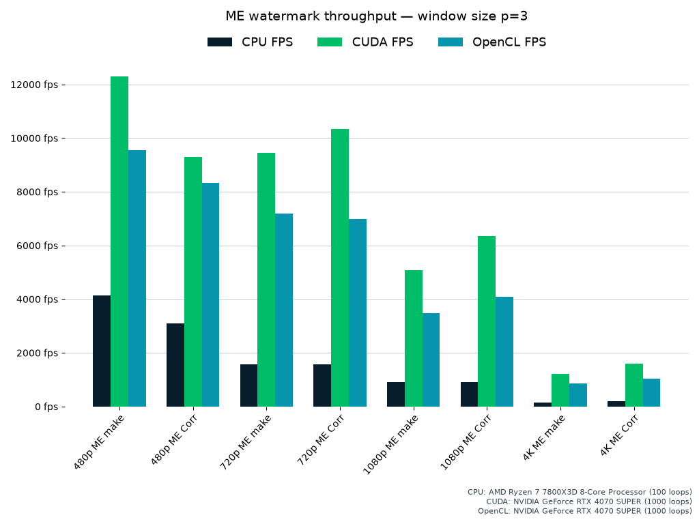 | 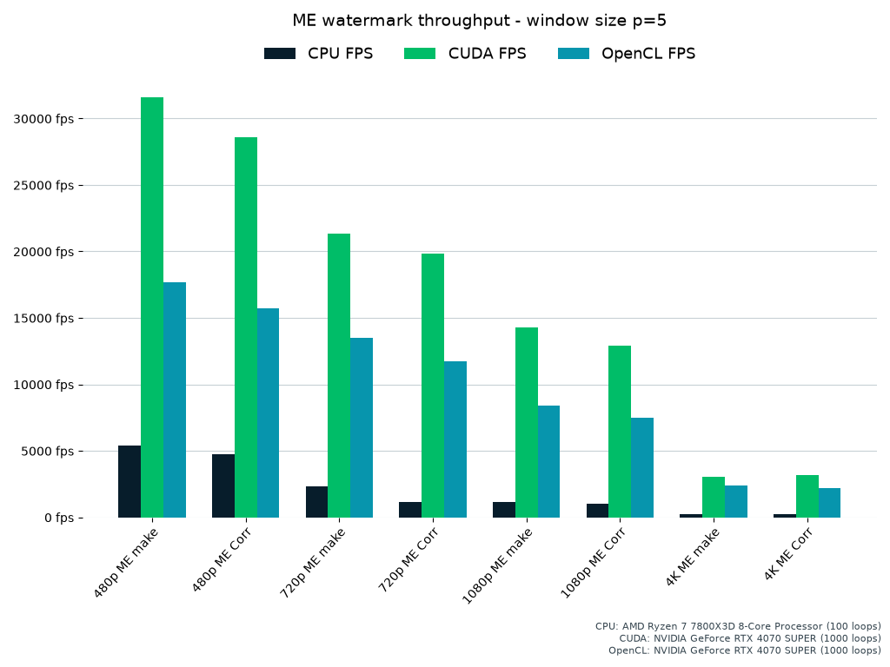
p = 7            |  p = 9
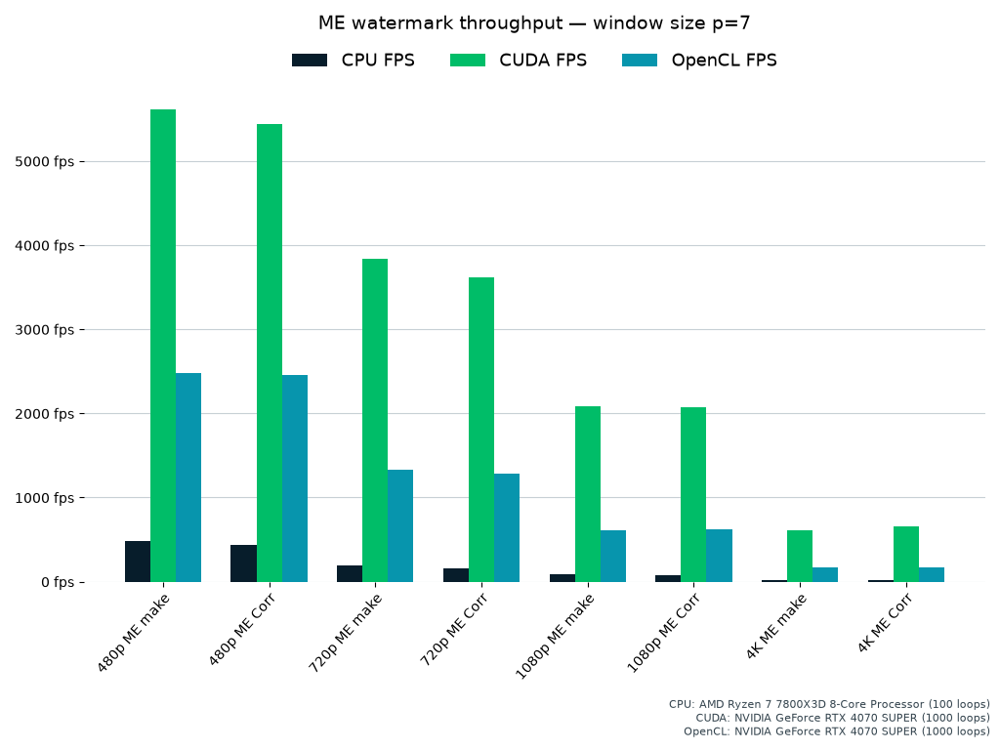 | 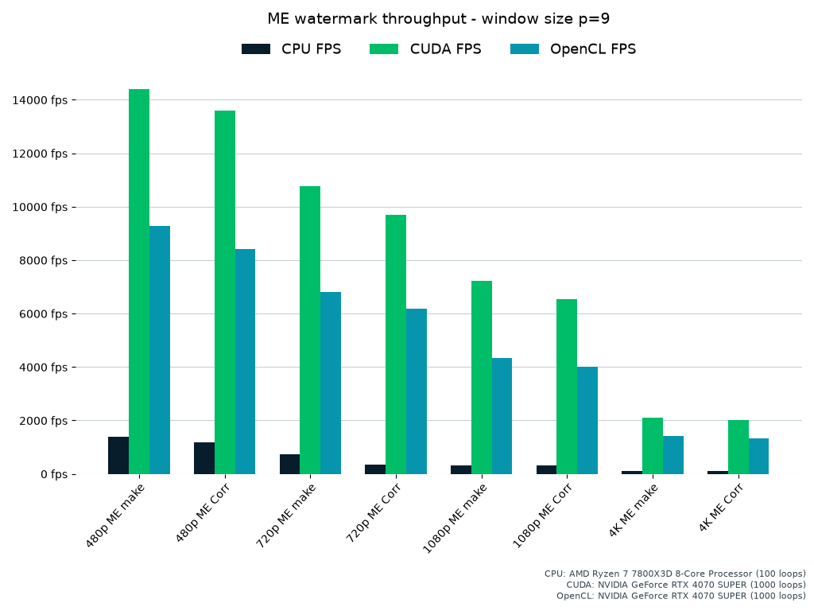

## GUI Benchmark Results

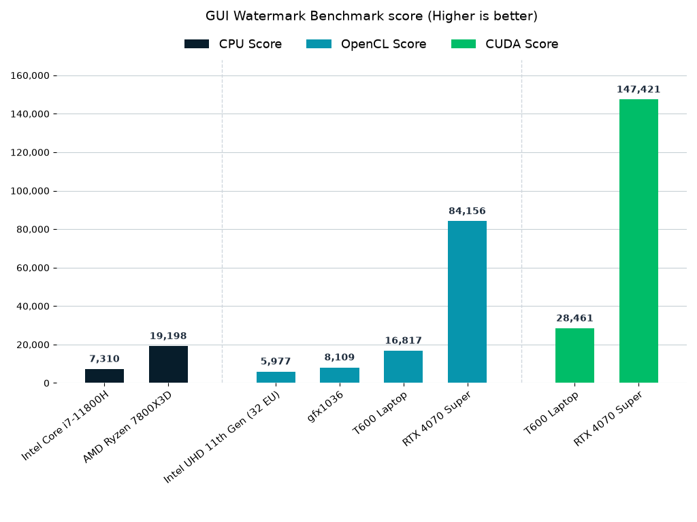


## GUI Screens

Preview | Detail
:-------------------------:|:-------------------------:
**Single image comparison**<br>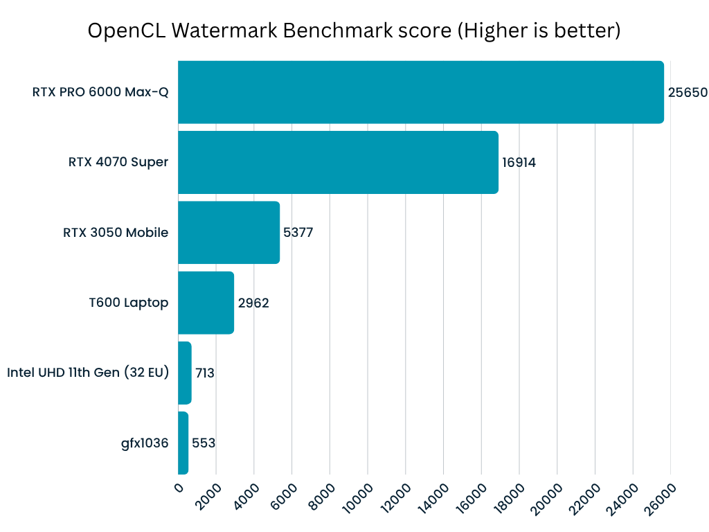 | **Zoomed comparison**<br>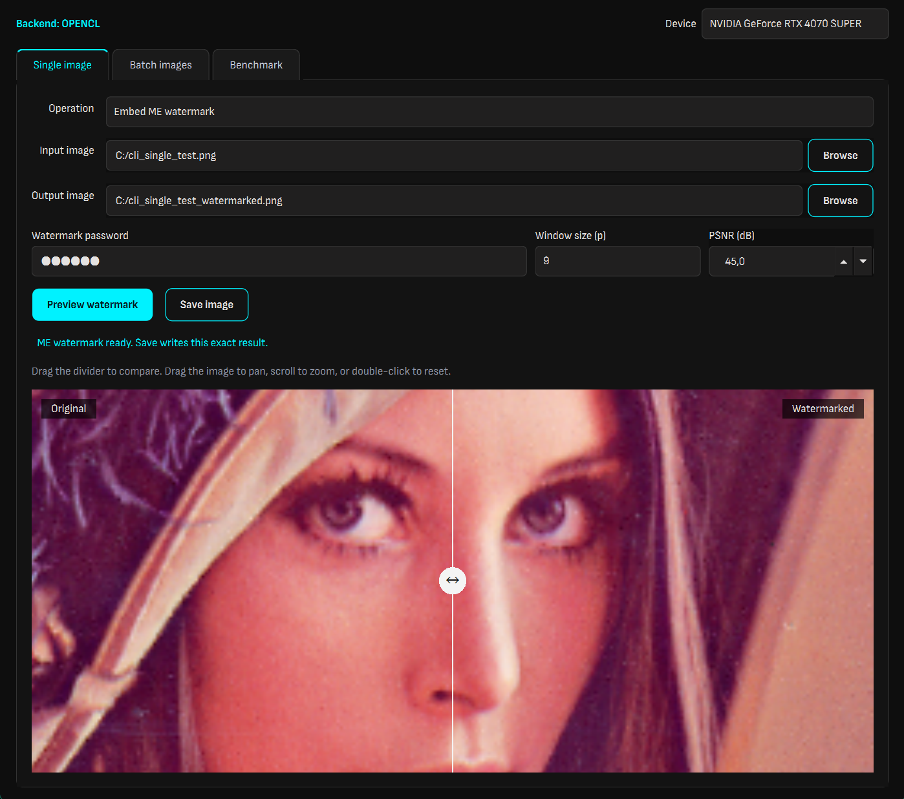
**Batch in progress**<br>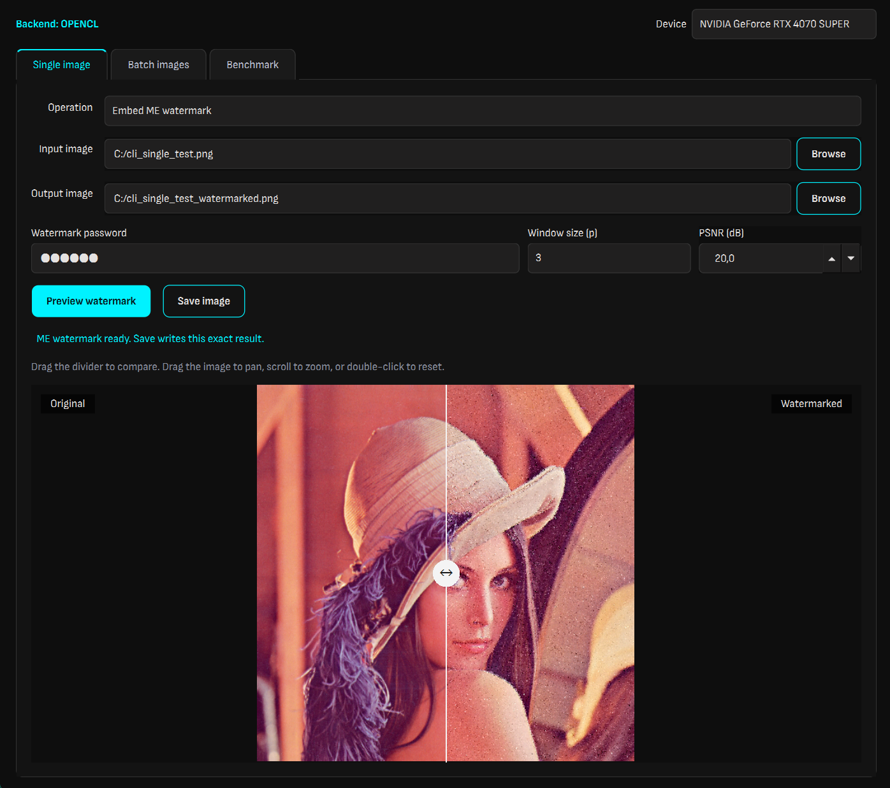 | **Batch complete**<br>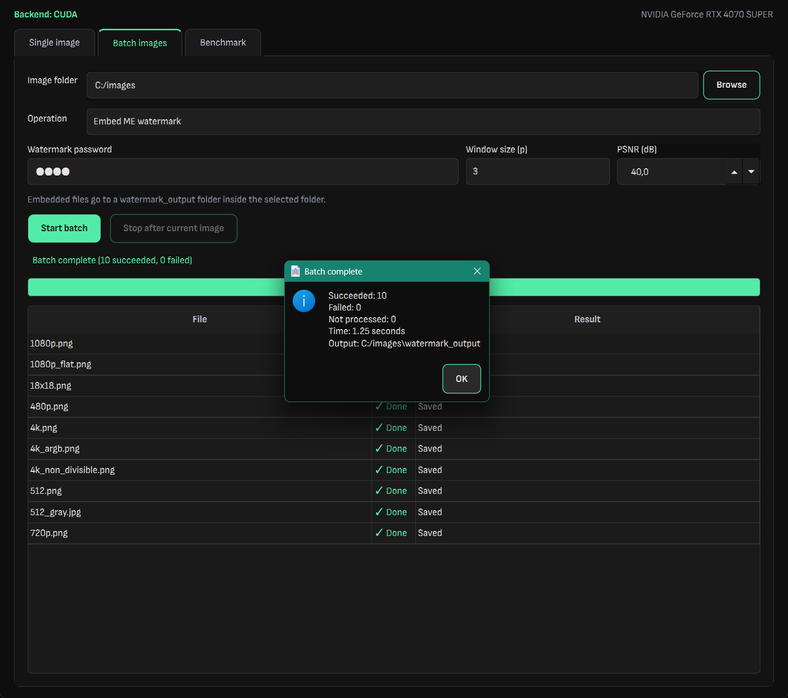
**Benchmark in progress**<br>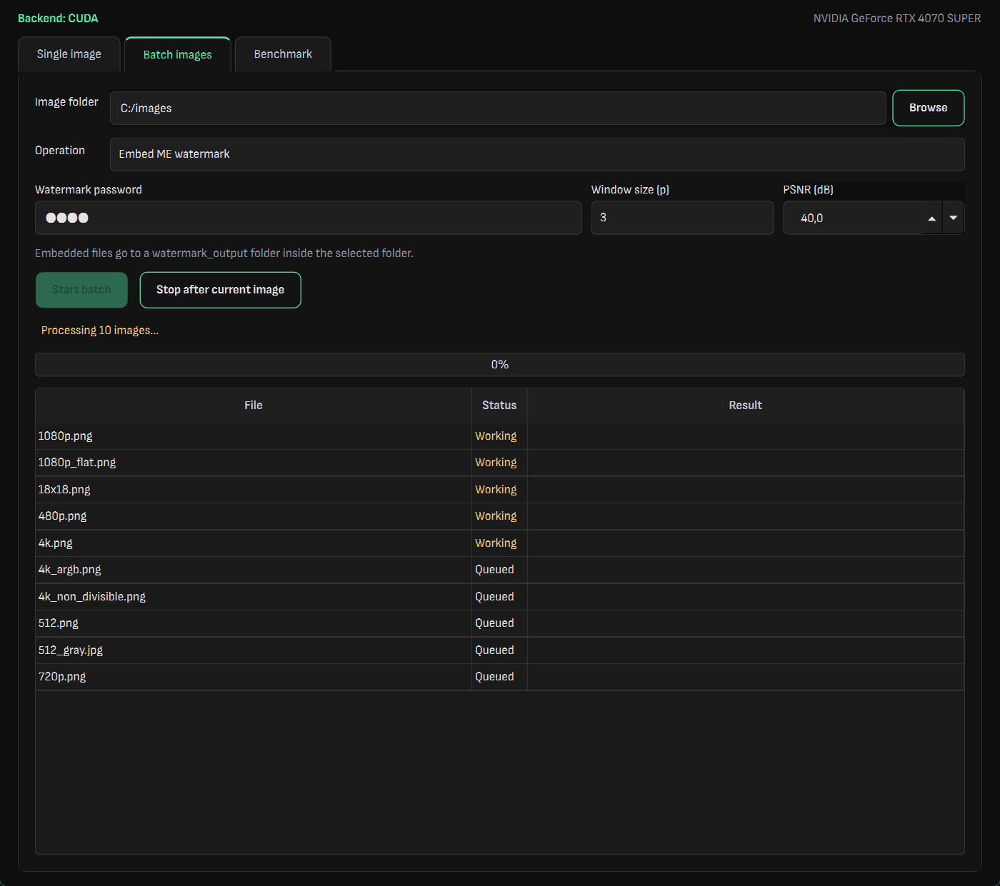 | **Benchmark score**<br>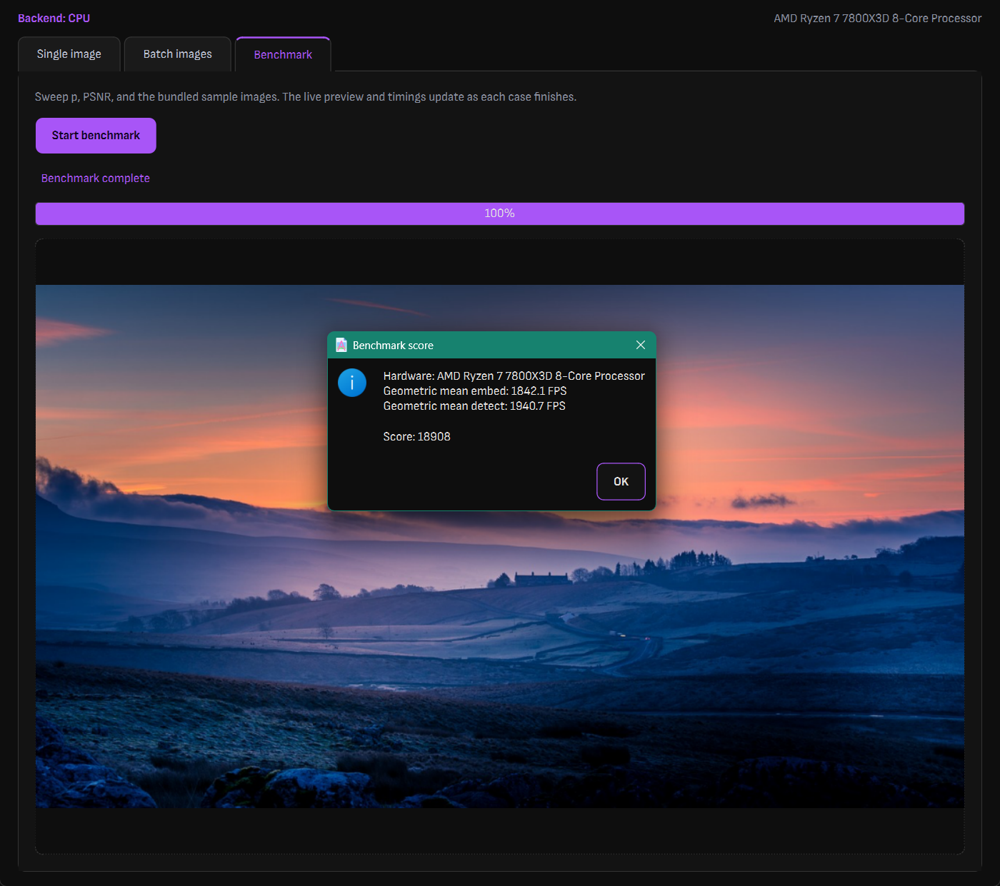

 
